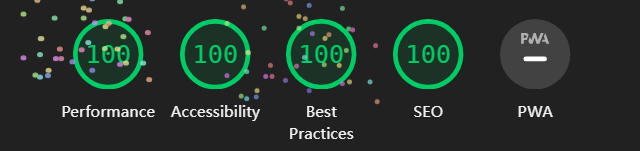

# Kurs Digitalkompetenz

A minimal, SEO-friendly portfolio and blog theme for Astro, supports Vue and UnoCSS.

## Preview


## Features

- 100 / 100 Lighthouse performance.
- Responsive.
- SEO-friendly.
- Light / Dark Theme.
- Markdown support.
- <a target="_blank" href="https://mdxjs.com/">MDX</a> (components in your markdown) support.
- <a target="_blank" href="https://vuejs.org/">Vue</a> SFC component support.
- Auto generated sitemap and RSS Feed <a target="_blank" href="https://vueuse.org/">VueUse</a> & <a target="_blank" href="https://lodash.com/">Lodash</a> support.
- Use the <a target="_blank" href="https://unocss.dev/">UnoCSS</a> for style, it's fast.

## Lighthouse Performance



## Quick Start

[](https://app.netlify.com/start/deploy?repository=https://github.com/kieranwv/astro-theme-vitesse)

Click this button, it will create a new repo for you that looks exactly like this one, and sets that repo up immediately for deployment on Netlify.

If you  just want to develop locally, you can [create a repo](https://github.com/kieranwv/astro-theme-vitesse/generate) from this template on GitHub.

## Usage

First, install the dependencies.

```bash
pnpm install
```

Just run and visit http://localhost:1977.

```bash
pnpm run dev
```

> Node.js version 20 or higher is required for this project.

To build the App, you can run:

```bash
pnpm run build
```

You will then see the `dist` folder generated for publishing, which you can preview locally with the following command.

```bash
pnpm run preview
```

## License

[MIT License](./LICENSE) © 2024 [Kieran Wang](https://github.com/kieranwv/)
