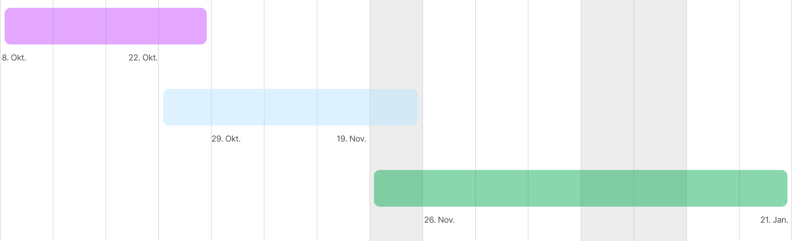
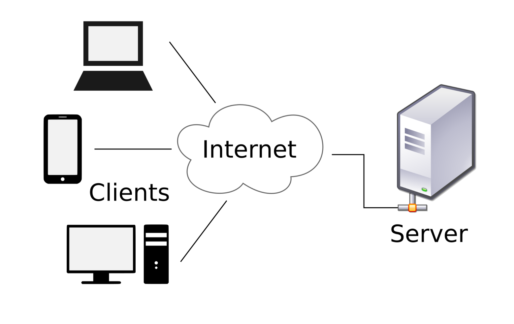
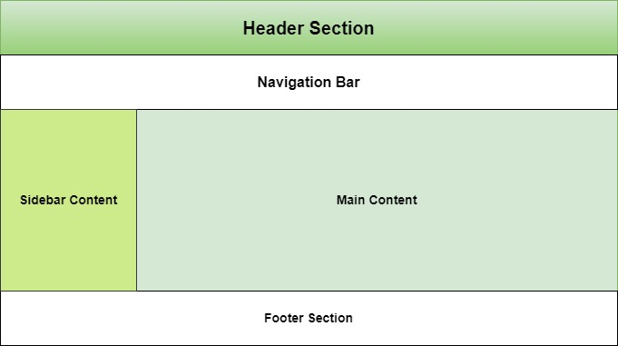
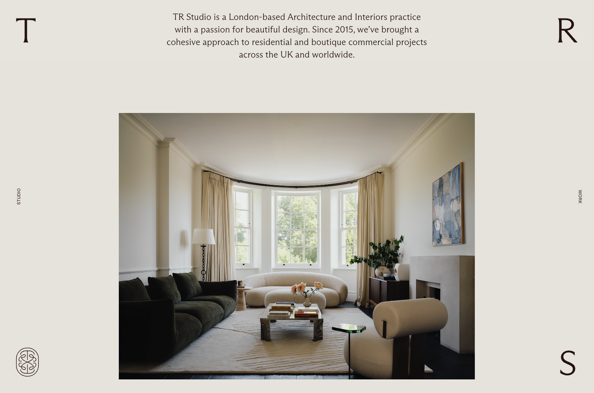
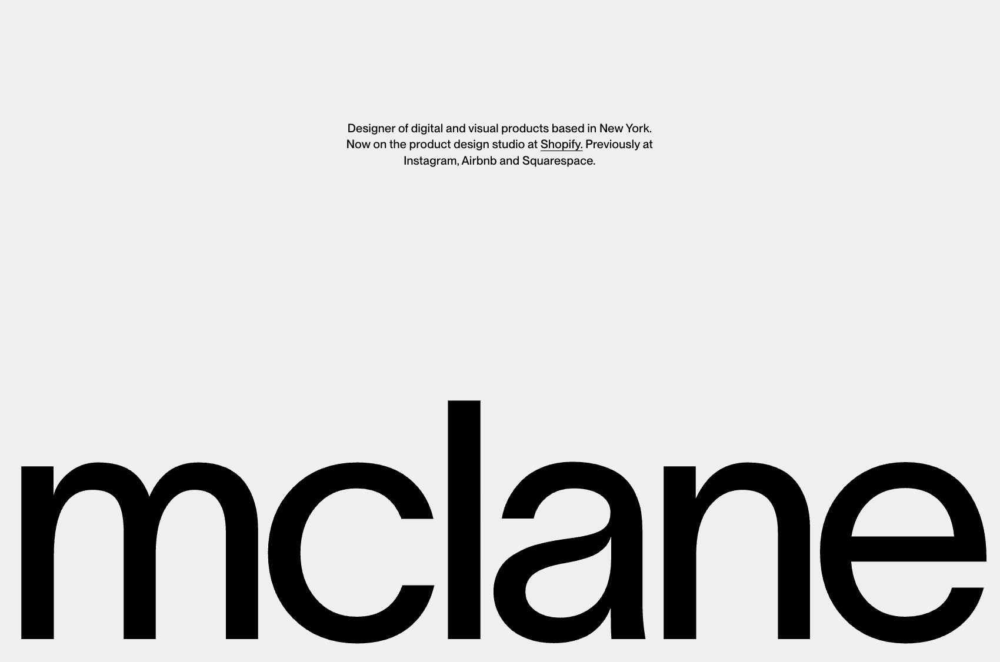
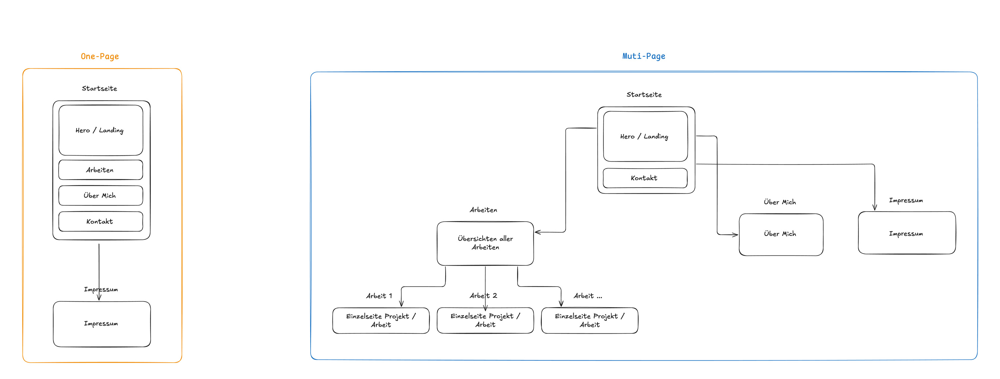
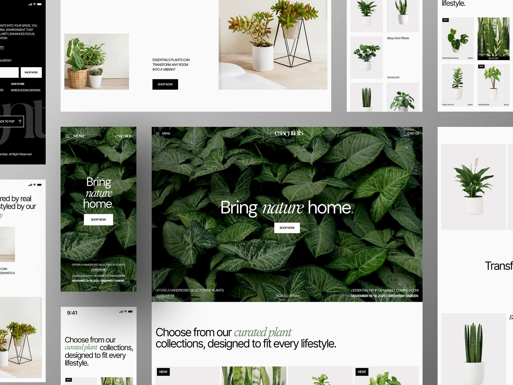
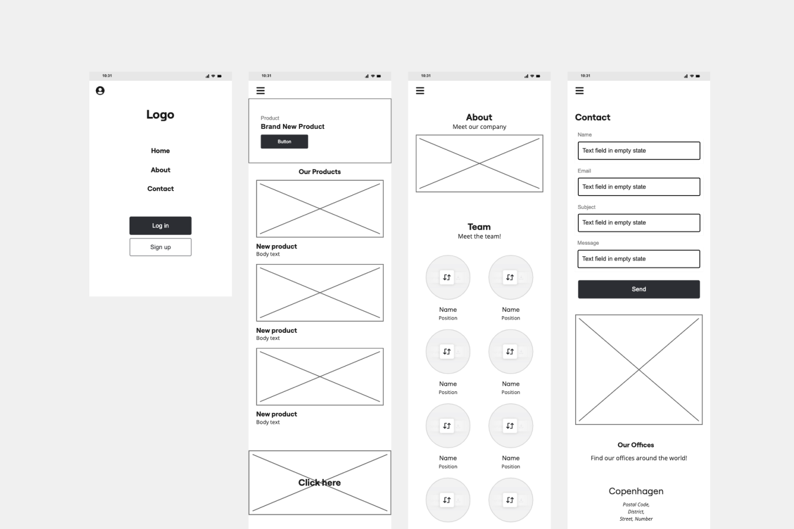
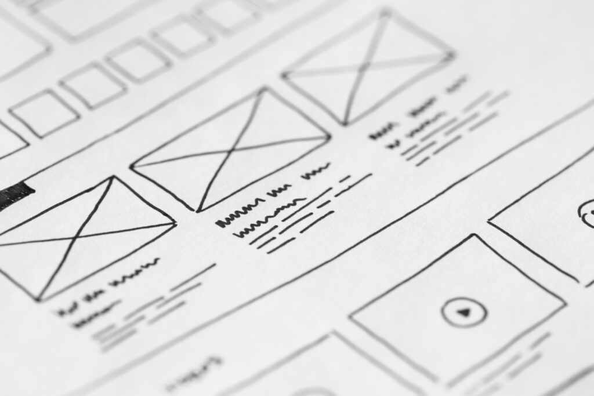

## Ziel des Kurses

- Grundlagen der Webentwicklung verstehen und anwenden
- Portfolio-Struktur visuell ansprechend konzipieren
- Arbeiten optimal für das Web präsentieren
- Technische Herausforderungen wie Responsiveness erfolgreich lösen
- Eigene Portfolio-Website gestalten und umsetzen

---

## Zeitplan, Termine, Abgaben

**26.11.26  Zwischenabgabe & Präsentation**
 Ein ausgearbeitetes Portfolio Design in Figma für Desktop und Mobile. Tablet-Ansicht ist ist optional. Die Webseite sollte aus mindestens zwei einzelnen Seiten bestehen und Arbeiten gut darstellen. Ein Figma Link per e-Mail ist ausreichend als Abgabe, es muss aber in der Unterrichtsstunde präsentiert werden (max. 2-3 min).

**21.01.27  Abgabe & Abschlusspräsentation**
Eine persönliche Portfolio-Website, die deine fotografischen Arbeiten professionell präsentiert. Die Umsetzung soll dem UI-Design entsprechen, responsive funktionieren und technisch sauber implementiert sein. Ein Link ist ausreichend, kann aber auch als .zip angeliefert werden. Für die Präsentation musst du deine Webseite in 3-5min. präsentieren.

**Bewertungskriterien**
- 25% Design: Visuelle Umsetzung, Konsistenz
- 25% Funktion: Navigation, Links, alle Features funktionieren
- 25% Responsiveness: Darstellung auf Desktop und Mobile Geräten
- 25% Umsetzung: Technische Qualität, Performance, Details



---

## Das Internet: Ein globales Netzwerk

**Das Internet ist wie ein riesiges Postverteilungszentrum**

- Ein Netzwerk der Netzwerke: Das Internet ist ein globales System miteinander verbundener Computer- und Datennetzwerke.
- Heterogene Technologien: Es nutzt verschiedene Technologien und Topologien um Informationen zu übertragen.
- Dezentrale Struktur: Obwohl es keine zentrale Kontrollinstanz gibt, basiert das Internet auf einer riesigen, dezentralen Infrastruktur.

**Grundprinzip:**
- Computer A möchte Daten von Computer B
- Die Daten werden in Pakete aufgeteilt
- Diese Pakete reisen über verschiedene Wege
- Am Ziel werden sie wieder zusammengefügt

---

## Client-Server Architektur

**Client = Der Fragesteller**

- Dein Browser (Chrome, Safari, Firefox)
- Deine Mobile App
- Stellt Anfragen

**Server = Der Antworter**

- Leistungsstarker Computer
- Speichert Websites und Daten
- Beantwortet Anfragen



---

## Domain, Hosting, Browser, DNS

### Domain
- Deine Webadresse: www.max-fotografie.de
- Muss gekauft/gemietet werden
- Verschiedene Endungen: .de, .com, .photography

### Hosting
- Speicherplatz für deine Website-Dateien
- Server, der 24/7 läuft
- Verschiedene Anbieter und Preise

### Browser
- Interpretiert HTML, CSS, JavaScript
- Verschiedene Browser = verschiedene Darstellung
- Zeigt die Website auf dem Endgerät an

### DNS (Domain Name System)
- Wandelt Domainnamen in IP-Adressen um (z. B. `google.com`) in IP-Adressen (z. B. `142.250.184.14`)
- Funktioniert wie ein „Telefonbuch des Internets“
- Organisiert Domains hierarchisch und verteilt

---
### Was passiert, wenn ich eine URL eingeben?

Schritt für Schritt: www.instagram.com

1. **DNS-Lookup:** Browser fragt "Wo ist instagram.com?"
2. **IP-Adresse:** DNS antwortet "Bei 157.240.15.35"
3. **Verbindung:** Browser kontaktiert diesen Server
4. **Anfrage:** "Schick mir die Instagram-Startseite"
5. **Antwort:** Server sendet HTML, CSS, JavaScript-Dateien
6. **Darstellung:** Browser baut die Seite zusammen

---

## Die drei Säulen des Web

### HTML - Die Struktur

**Hypertext Markup Language**

- Definiert den Inhalt
- Überschriften, Absätze, Bilder, Links
- Wie das Gerüst eines Hauses

### CSS - Das Aussehen

**Cascading Style Sheets**

- Definiert das Design
- Farben, Schriften, Layout, Animationen
- Wie die Inneneinrichtung eines Hauses

### JavaScript - Die Interaktion

- Definiert das Verhalten
- Buttons, Formulare, dynamische Inhalte
- Wie die Elektronik eines Hauses

Wie dieser Code konkret aussieht und wie man damit eine Seite baut, sehen wir in Einheit 03.

---

## Klassische Webseite Informationsarchitektur

### Header
- Logo oder Name
- Hauptnavigation
- Call-to-Action

### Navigation
- Menüstruktur
- Orientierung für Besucher
- Oft auch im Header

### Content (Hauptinhalt)
- Texte, Bilder, Projekte
- Der wichtigste Bereich

### Footer
- Kontaktinformationen
- Impressum, Datenschutz


[Bild Quelle](https://www.tutorialspoint.com/css/css_layouts.htm)

---
### Alternative Layout Beispiele


[trstudio.co.uk](https://trstudio.co.uk)


[mclaneteitel.com](https://www.mclaneteitel.com/)

---

## Klassische Strukturen für Portfolios

### One-Page Portfolio

```
- Hero mit Namen
- Portfolio-Galerie
- Über mich
- Kontakt (einfach eine e-mail Adresse)
```

### Multi-Page Portfolio

```
- Home
- Portfolio (mit Projekten)
	- Einzelseite je Projekte
- Über mich
- Kontakt (ggf. als Formular, e-mail ist aber immer okay.)
```

**Grundprinzipien:**
- Klarheit: Besucher wissen immer, wo sie sind
- Hierarchie: Wichtiges zuerst
- Auffindbarkeit: Inhalte sind leicht zu finden



---

## Responsive Design

**Die Herausforderung:**
- Desktop: 1200px breit oder mehr
- Tablet: 768px - 1024px breit
- Handy: 375px - 414px breit

**Eine Website muss auf allen gut aussehen, daher müssen wir Anpassungen für verschiedenen Bildschirmgrößen vornehmen**
- Layout müssen angepasst werden
- Inhalte müssen reorganisiert weren
- Hover (Mouseover) Effekte existieren auf Touchgeräten nicht
- Schriftgrößen und Abstände ändern sich


[Bild Quelle](https://dribbble.com/shots/25237757-Essentials-Plant-E-commerce-Responsive-Design)

---

## Frage: Was will ein Besucher?

**Ein typischer Besucher möchte...**
1. Deine Arbeiten sehen
2. Den Stil verstehen
3. Ein paar Informationen über dich
4. Einen Kontakt finden (E-Mail, Social Media, Telefon, Formular)

**Die 3-Sekunden-Regel:**
Ein Besucher entscheidet in den ersten 3 Sekunden, ob er bleibt. Diese Regel ist natürlich nicht in Stein gemeißelt, gilt aber zumindest sie als Daumenregel.

**Daher muss sofort klar sein:**
- Wer bist du?
- Was machst du?
- Warum sollte ich bleiben?


---

## Content-Audit: Was brauche ich?

**Bilder:**
- Welche 10-15 besten Arbeiten?
- Passen sie stilistisch zusammen?

**Texte:**
- Kurze Selbstbeschreibung (2-3 Sätze)
- Projekt-Beschreibungen
- Kontaktinformationen

**Organisatorisches:**
- Social Media Accounts
- Impressum / Datenschutz

**Qualität vor Quantität:** Lieber 10 exzellente Bilder als 30 mittelmäßige. Oder 3-5 Projekte vor 8.


---

## Wireframing

**Was sind Wireframes?** 

Einfache Skizzen, die zeigen:
- Wo kommen welche Elemente hin?
- Wie groß sind die Bereiche?
- Wie ist die Hierarchie?

**Wireframe-Elemente:**

- Rechtecke: Container, Bereiche
- Kreuz im Rechteck: Bild-Platzhalter
- Horizontale Linien: Text
- Rechteck mit Text: Button


[Bild Quelle](https://miro.com/templates/wireframe/)

---

## Praxis: Wireframe auf Papier

Skizziere 2-3 Layout-Ideen für deine Portfolio-Startseite.


[Bild Quelle](https://learntocodewith.me/learn/wireframing/)

---

## Hausaufgabe

- Gedanken machen, welche Arbeiten du gerne zeigen würdest.
- Kurze Selbstbeschreibung schreiben (2-3 Sätze)
- Kontaktinformationen zusammenstellen
- Alles am besten als Notiz oder Worddokument.