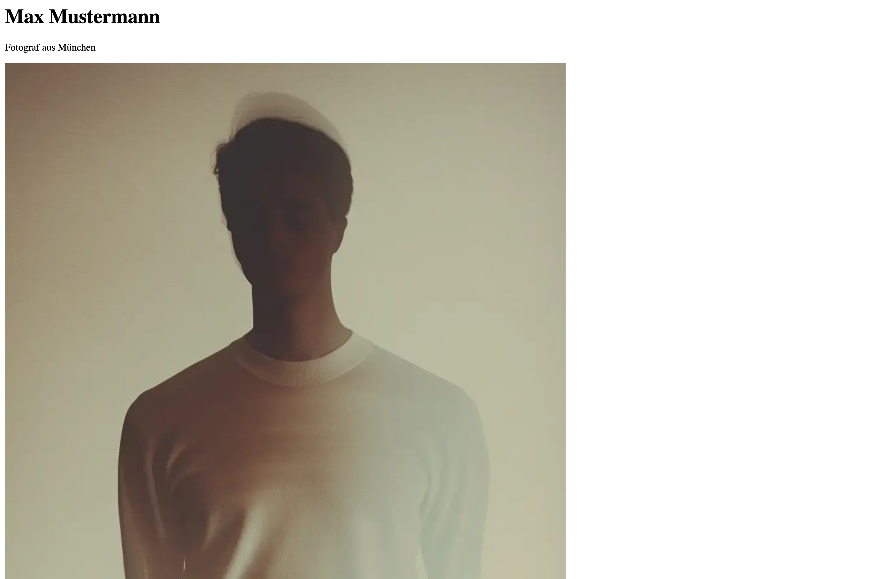

## Agenda

1. Kursüberblick
	- [Ziel des Kurses](#ziel-des-kurses)
	- [Zeitplan, Termine, Abgaben](#zeitplan-termine-abgaben)
2. Grundlagen
	- [Das Internet: Ein globales Netzwerk](#das-internet-ein-globales-netzwerk)
	- [Client-Server Architektur](#client-server-architektur)
	- [Domain, Hosting, Browser, DNS](#domain-hosting-browser-dns)
	- [Die drei Säulen des Web](#die-drei-säulen-des-web)
	- [HTML Beispiel](#html-beispiel)
	- [Inspirationsquellen](#inspirationsquellen-für-webdesign)
3. [Praxis: Unsere erste HTML/CSS Seite](#praxis-unsere-erste-htmlcss-seite)
	- [HTML Grundstruktur](#html-grundstruktur)
	- [CSS Styling](#css-styling-hinzufügen)
	- [Responsive Verhalten](#responsive-verhalten-hinzufügen)
	- [Bonus: Interaktivität](#bonus-interaktivitaet-hinzufügen)
4. [Hausaufgabe](#hausaufgabe)

---

## Ziel des Kurses

- Grundlagen der Webentwicklung verstehen und anwenden
- Portfolio-Struktur visuell ansprechend konzipieren
- Arbeiten optimal für das Web präsentieren
- Technische Herausforderungen wie Responsiveness erfolgreich lösen
- Eigene Portfolio-Website gestalten und umsetzen

---

## Zeitplan, Termine, Abgaben

**27.11.25  Zwischenabgabe**
 Ein ausgearbeitetes Portfolio Design in Figma für Desktop und Mobile. Tablet-Ansicht ist ist optional. Die Webseite sollte aus mindestens zwei einzelnen Seiten bestehen und Arbeiten gut darstellen. Ein Figma Link per e-Mail ist ausreichend.

**30.01.26  Abgabe**
Eine persönliche Portfolio-Website, die Ihre fotografischen Arbeiten professionell präsentiert. Die Umsetzung soll dem UI-Design entsprechen, responsive funktionieren und technisch sauber implementiert sein. Ein Link ist ausreichend, kann aber auch als .zip angeliefert werden.

**Bewertungskriterien**
- 25% Design: Visuelle Umsetzung, Konsistenz
- 25% Funktion: Navigation, Links, alle Features funktionieren
- 25% Responsiveness: Darstellung auf Desktop und Mobile Geräten
- 25% Umsetzung: Technische Qualität, Performance, Details


---

## Das Internet: Ein globales Netzwerk

**Das Internet ist wie ein riesiges Postverteilungszentrum**

- Ein Netzwerk der Netzwerke: Das Internet ist ein globales System miteinander verbundener Computer- und Datennetzwerke.
- Heterogene Technologien: Es nutzt verschiedene Technologien und Topologien um Informationen zu übertragen.
- Dezentrale Struktur: Obwohl es keine zentrale Kontrollinstanz gibt, basiert das Internet auf einer riesigen, dezentralen Infrastruktur.

**Grundprinzip:**
- Computer A möchte Daten von Computer B
- Die Daten werden in Pakete aufgeteilt
- Diese Pakete reisen über verschiedene Wege
- Am Ziel werden sie wieder zusammengefügt

---

## Client-Server Architektur

**Client = Der Fragesteller**

- Ihr Browser (Chrome, Safari, Firefox)
- Ihre Mobile App
- Stellt Anfragen

**Server = Der Antworter**

- Leistungsstarker Computer
- Speichert Websites und Daten
- Beantwortet Anfragen


### Was passiert, wenn ich eine URL eingeben?

**Schritt für Schritt: www.instagram.com

1. **DNS-Lookup:** Browser fragt "Wo ist instagram.com?"
2. **IP-Adresse:** DNS antwortet "Bei 157.240.15.35"
3. **Verbindung:** Browser kontaktiert diesen Server
4. **Anfrage:** "Schick mir die Instagram-Startseite"
5. **Antwort:** Server sendet HTML, CSS, JavaScript-Dateien
6. **Darstellung:** Browser baut die Seite zusammen

---

## Domain, Hosting, Browser, DNS

### Domain
- Ihre Webadresse: www.max-fotografie.de
- Muss gekauft/gemietet werden
- Verschiedene Endungen: .de, .com, .photography

### Hosting
- Speicherplatz für Ihre Website-Dateien
- Server, der 24/7 läuft
- Verschiedene Anbieter und Preise

### Browser
- Interpretiert HTML, CSS, JavaScript
- Verschiedene Browser = verschiedene Darstellung
- Zeigt die Website auf dem Endgerät an

### DNS (Domain Name System)
- Wandelt Domainnamen in IP-Adressen um (z. B. `google.com`) in IP-Adressen (z. B. `142.250.184.14`)
- Funktioniert wie ein „Telefonbuch des Internets“
- Organisiert Domains hierarchisch und verteilt

---

## Die drei Säulen des Web

### HTML - Die Struktur

**Hypertext Markup Language**

- Definiert den Inhalt
- Überschriften, Absätze, Bilder, Links
- Wie das Gerüst eines Hauses

### CSS - Das Aussehen

**Cascading Style Sheets**

- Definiert das Design
- Farben, Schriften, Layout, Animationen
- Wie die Inneneinrichtung eines Hauses

### JavaScript - Die Interaktion

- Definiert das Verhalten
- Buttons, Formulare, dynamische Inhalte
- Wie die Elektronik eines Hauses

---

## HTML Beispiel

```html
<!DOCTYPE html>
<html>
<head>
    <title>Mein Portfolio</title>
</head>
<body>
    <h1>Max Mustermann</h1>
    <p>Fotograf aus München</p>
    
</body>
</html>
```

**Das sieht der Browser:**

- Große Überschrift: "Max Mustermann"
- Text darunter: "Fotograf aus München"
- Ein Bild namens "portrait.jpg"



[](https://codesandbox.io/p/sandbox/vs8s3z)

---

## CSS Beispiel

```css
h1 {
  color: #333;
  font-size: 48px;
  font-family: 'Helvetica', sans-serif;
}

p {
  color: #666;
  font-size: 18px;
  line-height: 1.5;
}

img {
  width: 300px;
  border-radius: 10px;
}
```

**Jetzt wird aus der langweiligen HTML-Seite:**
- Schöne Schrift und Farben
- Größere, lesbare Texte
- Abgerundete Bildecken


---

## Responsive Design

**Die Herausforderung:**
- Desktop: 1200px breit oder mehr
- Tablet: 768px - 1024px breit
- Handy: 375px - 414px breit

**Eine Website muss auf allen gut aussehen, daher müssen wir Anpassungen für verschiedenen Bildschirmgrößen vornehmen**
- Layout müssen angepasst werden
- Inhalte müssen reorganisiert weren
- Hover (Mouseover) Effekte existieren auf Touchgeräten nicht
- Schriftgrößen und Abstände ändern sich


[Bild Quelle](https://dribbble.com/shots/25237757-Essentials-Plant-E-commerce-Responsive-Design)

---

## Inspirationsquellen für Webdesign

Gute Inspirationen im Bereich Webdesign sind nicht immer leicht zu finden, aber es gibt einige Websites, die ich auf jeden Fall empfehlen kann. Diese legen großen Wert auf hochwertiges Webdesign und präsentieren Beispiele aus der Praxis – nicht nur UI-Designs, die auf Screenshots vielleicht toll aussehen, aber in der Praxis nicht wirklich funktionieren. Viele Designs von Dribbble und Behance scheitern, weil sie aus UX-Sicht nicht funktionieren.

- [awwwards.com](https://awwwards.com)
- [mobbin.design](https://mobbin.design)
- [minimal.gallery](https://minimal.gallery)
- [wellcoded.co](https://wellcoded.co)

**Als (Web)Designer sollte man:**
- Trends verstehen, aber nicht blind folgen
- Technische Machbarkeit einschätzen
- User Experience analysieren
- Eigenen Stil entwickeln

**Achten Sie auf:**
- Warum funktioniert diese Website gut?
- Wie ist die Navigation gelöst?
- Wie werden Bilder präsentiert?
- Gibt es Animationen, die die Seite besonders machen?

---

## Praxis: Unsere erste HTML/CSS Seite

**Wir erstellen gemeinsam:**
- Eine simple Portfolio-Startseite
- Mit HTML-Struktur
- Mit CSS-Styling
- Responsive Grundlagen

**Sie lernen dabei:**
- Wie Code und Darstellung zusammenhängen
- Warum Framer/Webflow im Hintergrund ähnlich arbeiten
- Das Fundament aller Websites

[](https://codesandbox.io/p/sandbox/5l9nfp)


---

## HTML Grundstruktur

```html
<!-- index.html -->

<!DOCTYPE html>
<html lang="de">
	<head>
		<meta charset="UTF-8" />
		<meta name="viewport" content="width=device-width, initial-scale=1.0" />
		<title>Max Mustermann - Fotograf</title>
	</head>
	<body>
		<!-- Header-Bereich mit Name und Beruf und Instagram -->
		<header>
			<h1>Max Mustermann</h1>
			<p>Fotograf aus München</p>

			<a
				href="https://instagram.com/d.tampe"
				target="_blank"
				style="margin-top: 10px; display: inline-block"
			>
				
			</a>
		</header>

		<!-- Hauptinhalt der Seite -->
		<main>
			<section class="portfolio">
				<h2>Meine Arbeiten</h2>
				<p>Spezialisiert auf Portraits</p>

				<!-- Bildergalerie mit 6 Beispielbildern -->
				<div class="gallery">
					<div class="gallery-item">
						
					</div>
					<div class="gallery-item">
						
					</div>
					<div class="gallery-item">
						
					</div>
					<div class="gallery-item">
						
					</div>
					<div class="gallery-item">
						
					</div>
					<div class="gallery-item">
						
					</div>
				</div>
			</section>
		</main>
	</body>
</html>
```


---

## CSS Styling hinzufügen

 Um die Webseite ansprechend zu gestalten und die Bilder optimal anzuordnen, stylen wir die Seite mit CSS. Dies umfasst die Implementierung einer Galerie mit drei Spalten, in der die Bilder gleichmäßig hoch dargestellt werden. Dafür muss die Datei `style.css` erstellt werden und auch in die `index.html` Datei eingebunden werden.

```html
<!-- index.html -->
<head>
	<meta charset="UTF-8" />
	<meta name="viewport" content="width=device-width, initial-scale=1.0" />
	<title>Max Mustermann - Fotograf</title>
	<link rel="stylesheet" href="style.css" /> <!-- <- Diese Zeile -->
</head>
<body>
<!-- [...] -->
```

```css
/* style.css */

/* Reset: Entfernt Browser-Standard-Styles */
* {
  margin: 0;
  padding: 0;
  box-sizing: border-box;
}

/* Grundlegende Body-Styles */
body {
  font-family: -apple-system, sans-serif;
  line-height: 1.6;
  color: #333;
}

/* Header-Styling mit grauem Hintergrund */
header {
  padding: 60px 20px;
  text-align: center;
  background-color: #f8f8f8;
}

/* Große Hauptüberschrift */
h1 {
  font-size: 3rem;
  margin-bottom: 10px;
}

/* Portfolio-Sektion mit begrenzter Breite und zentriert */
.portfolio {
  padding: 60px 20px;
  max-width: 1200px;
  margin: 0 auto;
  text-align: center;
}

/* Bildergalerie als CSS Grid */
.gallery {
  display: grid;
  grid-template-columns: repeat(3, 1fr); /* 3 Spalten auf Desktop */
  gap: 20px; /* Abstand zwischen den Bildern */
  margin-top: 40px;
}

/* Styling für die Galerie-Bilder */
.gallery-item img {
  width: 100%; /* Bild füllt Container aus */
  height: 250px; /* Feste Höhe für einheitliches Raster */
  object-fit: cover; /* Bild wird zugeschnitten, behält Proportionen */
  border-radius: 8px; /* Abgerundete Ecken */
  transition: transform 0.3s ease; /* Weiche Animation für Hover-Effekt */
}
```


---

## Responsive Verhalten hinzufügen

Damit unsere Website auch auf allen Geräten gleich gut aussieht, müssen wir nun noch so genannte Media-Queries hinzufügen.

```css
/* style.css */

/* Tablet-Ansicht: 2 Spalten statt 3 */
@media (max-width: 768px) {
  h1 {
    font-size: 2rem; /* Kleinere Überschrift */
  }

  header {
    padding: 40px 15px; /* Weniger Padding */
  }

  .portfolio {
    padding: 40px 15px;
  }

  .gallery {
    grid-template-columns: repeat(2, 1fr); /* 2 Spalten auf Tablet */
    gap: 15px; /* Kleinerer Abstand */
  }
}

/* Mobile-Ansicht: 1 Spalte */
@media (max-width: 480px) {
  .gallery {
    grid-template-columns: 1fr; /* Nur 1 Spalte auf Mobile */
    gap: 15px;
  }

  .gallery-item img {
    height: 200px; /* Kleinere Bildhöhe auf Mobile */
  }
}

/* Sehr große Bildschirme: Noch größere Überschrift */
@media (min-width: 1200px) {
  h1 {
    font-size: 4rem;
  }
}
```

**Test:** Browserfenster kleiner/größer ziehen

---

## Bonus: Interaktivität hinzufügen

Die einfachste Möglichkeit, Interaktivität hinzuzufügen, besteht darin, eine CSS-Transition für Effekte wie Mouse Over oder Hover zu verwenden.

```css
/* style.css */

/* Hover-Effekt: Bild wird leicht vergrößert */
.gallery-item img:hover {
  transform: scale(1.05);
}
```

Um die Seite noch interaktiver zu gestalten, habe ich einen kleinen Bonus vorbereitet. Wir fügen eine Lightbox hinzu. Das bedeutet, wenn man auf ein Bild klickt, wird es mittig groß über anderen Inhalten angezeigt.

```css
/* lightbox.css */

/* Lightbox Overlay */
.lightbox {
  position: fixed;
  top: 0;
  left: 0;
  width: 100vw;
  height: 100vh;
  background: rgba(0, 0, 0, 0.8);
  display: none; /* versteckt */
  justify-content: center;
  align-items: center;
}

.lightbox img {
  max-width: 90%;
  max-height: 90%;
  border-radius: 6px;
}

.lightbox.show {
  display: flex; /* sichtbar machen */
}
```

Wir müssen die neue CSS Datei natürlich auch wieder in unserem HTML referenzieren. Darüber hinaus fügen wir kurz vor dem Ende vor dem Endtag `</body>` in der HTML noch weitere Zeilen hinzu, die sowohl ein neues Script referenziert und auch die HTML Struktur für die Lightbox schafft.

```html
<!-- index.html -->
<head>
	<meta charset="UTF-8" />
	<meta name="viewport" content="width=device-width, initial-scale=1.0" />
	<title>Max Mustermann - Fotograf</title>
	<link rel="stylesheet" href="style.css" />
	<link rel="stylesheet" href="lightbox.css" /> <!-- <- Diese Zeile für das Lightbox CSS -->
</head>
<body>
	<!-- [...] -->

	<!-- START CODE BLOCK -->
	<div class="lightbox" id="lightbox">
		
	</div>
	<script src="script.js" defer></script>
	<!-- ENDE CODE BLOCK -->
</body>
```

Wir legen eine neue Datei an: `script.js`. Wie vorher erwähnt können wir mit Javascript Webseiten Interaktivität hinzufügen. Die Kommentare im Script erläutern die einzelnen Schritte.

```js
// script.js

// Das Lightbox-Element (Overlay) aus dem HTML auswählen
const lightbox = document.getElementById('lightbox')
// Das Bild innerhalb der Lightbox auswählen
const lightboxImg = lightbox.querySelector('img')

// Alle Bilder innerhalb der Galerie auswählen
document.querySelectorAll('.gallery-item img').forEach((element) => {
  // Für jedes Bild einen Klick-Listener hinzufügen
  element.addEventListener('click', () => {
    // Wenn man auf ein Bild klickt:

    // 1. Die Bildquelle (src) in das Lightbox-Bild übernehmen
    lightboxImg.src = element.src

    // 2. Auch den Alt-Text übernehmen (für Barrierefreiheit)
    lightboxImg.alt = element.alt

    // 3. Die Lightbox sichtbar machen, indem wir die CSS-Klasse "show" hinzufügen
    lightbox.classList.add('show')
  })
})

// Klick-Event für die Lightbox selbst
// -> Wenn man irgendwo ins Overlay klickt (nicht auf das Bild), wird sie wieder geschlossen
lightbox.addEventListener('click', () => {
  // Die CSS-Klasse "show" entfernen, damit die Lightbox verschwindet
  lightbox.classList.remove('show')
})
```

Unser finale Code sollte dann so aussehen:
[](https://codesandbox.io/p/sandbox/01-02-praxis-g468h5)

---

## Hausaufgabe

**Aufgabe:** Finden Sie 3 inspirierende Portfolio-Websites

- Screenshots der Elemente oder Seiten die Ihnen gut gefallen
- 1-2 Sätze: Was gefällt Ihnen und warum?
- Behalten Sie im Hinterkopf, dass Sie die ihr Portfolio selbst bauen müssen

**Tipps:** Nutzen Sie die vorgestellten Quellen als Startpunkt
