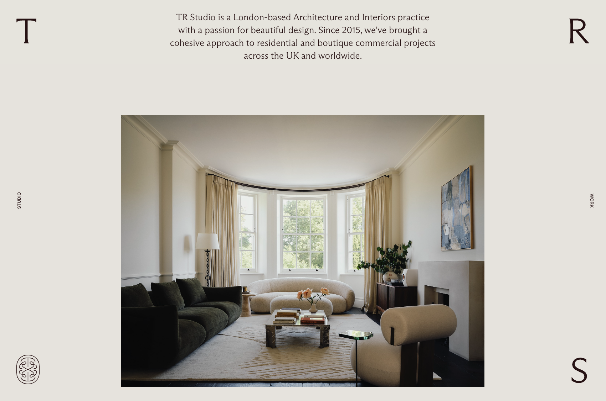

## Agenda

- [Webseitenarchitektur](#klassische-webseitenarchitektur)
- [Informationsarchitektur für Portfolios](#klassische-strukturen-für-portfolios)
- [User Experience Basics](#user-experience-basics-was-will-ein-besucher)
- [Content-Audit](#content-audit-was-brauche-ich)
- [Praxis: JavaScript & Interaktivität](#praxis-javascript--interaktivität)
- [Wireframes erstellen](#wireframing)
- [Hausaufgabe](#hausaufgabe)

---

## Klassische Webseitenarchitektur

### Header
- Logo oder Name
- Hauptnavigation
- Call-to-Action

### Navigation
- Menüstruktur
- Orientierung für Besucher
- Oft auch im Header

### Content (Hauptinhalt)
- Texte, Bilder, Projekte
- Der wichtigste Bereich

### Footer
- Kontaktinformationen
- Impressum, Datenschutz


[Bild Quelle](https://www.tutorialspoint.com/css/css_layouts.htm)

---
### Alternative Layout Beispiele


[trstudio.co.uk](https://trstudio.co.uk)


[mclaneteitel.com](https://www.mclaneteitel.com/)

---

## Klassische Strukturen für Portfolios

### One-Page Portfolio

```
- Hero mit Namen
- Portfolio-Galerie
- Über mich
- Kontakt (einfach eine e-mail Adresse)
```

### Multi-Page Portfolio

```
- Home
- Portfolio (mit Projekten)
	- Einzelseite je Projekte
- Über mich
- Kontakt (ggf. als Formular, e-mail ist aber immer okay.)
```

**Grundprinzipien:**
- Klarheit: Besucher wissen immer, wo sie sind
- Hierarchie: Wichtiges zuerst
- Auffindbarkeit: Inhalte sind leicht zu finden


---

## User Experience Basics: Was will ein Besucher?

**Ein typischer Besucher möchte...**
1. Ihre Arbeiten sehen
2. Den Stil verstehen
3. Ein paar Informationen über Sie
4. Einen Kontakt finden (E-Mail, Social Media, Telefon, Formular)

**Die 3-Sekunden-Regel:**
Ein Besucher entscheidet in den ersten 3 Sekunden, ob er bleibt. Diese Regel ist natürlich nicht in Stein gemeißelt, gilt aber zumindest sie als Daumenregel.

**Daher muss sofort klar sein:**
- Wer sind Sie?
- Was machen Sie?
- Warum sollte ich bleiben?


---

## Content-Audit: Was brauche ich?

**Bilder:**
- Welche 10-15 besten Arbeiten?
- Passen sie stilistisch zusammen?
- Verschiedene Formate verfügbar?

**Texte:**
- Kurze Selbstbeschreibung (2-3 Sätze)
- Projekt-Beschreibungen
- Kontaktinformationen

**Organisatorisches:**
- Social Media Accounts
- Impressum / Datenschutz

**Qualität vor Quantität:** Lieber 10 exzellente Bilder als 30 mittelmäßige. Oder 3-5 Projekte vor 8.


---
## Wireframing

**Was sind Wireframes?** Einfache Skizzen, die zeigen:

- Wo kommen welche Elemente hin?
- Wie groß sind die Bereiche?
- Wie ist die Hierarchie?

**Wireframe-Elemente:**

- Rechtecke: Container, Bereiche
- Kreuz im Rechteck: Bild-Platzhalter
- Horizontale Linien: Text
- Rechteck mit Text: Button


[Bild Quelle](https://miro.com/templates/wireframe/)

---

## Praxis: JavaScript & Interaktivität

**Was ist eine Lightbox?**
- Bild wird beim Klick groß angezeigt
- Overlay über der Seite
- Schließen durch Klick ins Dunkle

**Wir lernen:**
- Wie JavaScript mit HTML interagiert
- Event Listener für Klicks
- CSS-Klassen dynamisch hinzufügen/entfernen

--- 
### Interaktivität hinzufügen

[](https://codesandbox.io/p/sandbox/k89xxr)

Die einfachste Möglichkeit, Interaktivität hinzuzufügen, besteht darin, eine CSS-Transition für Effekte wie Mouse Over oder Hover zu verwenden.

```css
/* style.css */

/* Hover-Effekt: Bild wird leicht vergrößert */
.gallery-item img:hover {
  transform: scale(1.05);
}
```

Um die Seite noch interaktiver zu gestalten, habe ich einen kleinen Bonus vorbereitet. Wir fügen eine Lightbox hinzu. Das bedeutet, wenn man auf ein Bild klickt, wird es mittig groß über anderen Inhalten angezeigt.

```css
/* lightbox.css */

/* Lightbox Overlay - zunächst versteckt */
.lightbox {
  position: fixed;
  top: 0;
  left: 0;
  width: 100vw;
  height: 100vh;
  background: rgba(0, 0, 0, 0.8);
  display: none; /* versteckt */
  justify-content: center;
  align-items: center;
}

/* Bild in der Lightbox */
.lightbox img {
  max-width: 90%;
  max-height: 90%;
  border-radius: 6px;
}

/* Sichtbar machen mit der Klasse "show" */
.lightbox.show {
  display: flex;
}
```

Wir müssen die neue CSS Datei natürlich auch wieder in unserem HTML referenzieren. Darüber hinaus fügen wir kurz vor dem Ende vor dem Endtag `</body>` in der HTML noch weitere Zeilen hinzu, die sowohl ein neues Script referenziert und auch die HTML Struktur für die Lightbox schafft.

```html
<!-- index.html -->
<head>
	<meta charset="UTF-8" />
	<meta name="viewport" content="width=device-width, initial-scale=1.0" />
	<title>Max Mustermann - Fotograf</title>
	<link rel="stylesheet" href="style.css" />
	<link rel="stylesheet" href="lightbox.css" /> <!-- <- Diese Zeile für das Lightbox CSS -->
</head>
<body>
	<!-- [...] -->

	<!-- START CODE BLOCK -->
	<div class="lightbox" id="lightbox">
		
	</div>
	<script src="script.js" defer></script>
	<!-- ENDE CODE BLOCK -->
</body>
```

Wir legen eine neue Datei an: `script.js`. Wie vorher erwähnt können wir mit Javascript Webseiten Interaktivität hinzufügen. Die Kommentare im Script erläutern die einzelnen Schritte.

```js
// script.js

// Das Lightbox-Element (Overlay) aus dem HTML auswählen
const lightbox = document.getElementById('lightbox')
// Das Bild innerhalb der Lightbox auswählen
const lightboxImg = lightbox.querySelector('img')

// Alle Bilder innerhalb der Galerie auswählen
document.querySelectorAll('.gallery-item img').forEach((element) => {
  // Für jedes Bild einen Klick-Listener hinzufügen
  element.addEventListener('click', () => {
    // Wenn man auf ein Bild klickt:

    // 1. Die Bildquelle (src) in das Lightbox-Bild übernehmen
    lightboxImg.src = element.src

    // 2. Auch den Alt-Text übernehmen (für Barrierefreiheit)
    lightboxImg.alt = element.alt

    // 3. Die Lightbox sichtbar machen, indem wir die CSS-Klasse "show" hinzufügen
    lightbox.classList.add('show')
  })
})

// Klick-Event für die Lightbox selbst
// -> Wenn man irgendwo ins Overlay klickt (nicht auf das Bild), wird sie wieder geschlossen
lightbox.addEventListener('click', () => {
  // Die CSS-Klasse "show" entfernen, damit die Lightbox verschwindet
  lightbox.classList.remove('show')
})
```

Unser finale Code sollte dann so aussehen:
[](https://codesandbox.io/p/sandbox/01-02-praxis-g468h5)

## Praxis: Wireframe auf Papier

Skizzieren Sie 2-3 Layout-Ideen für Ihre Portfolio-Startseite.


[Bild Quelle](https://learntocodewith.me/learn/wireframing/)

---

## Hausaufgabe

**Content sammeln**
- Gedanken machen, welche Arbeiten Sie gerne Zeigen würden. 
- Kurze Selbstbeschreibung schreiben (2-3 Sätze)
- Kontaktinformationen zusammenstellen
- Alles am besten als Notiz oder Worddokument.


