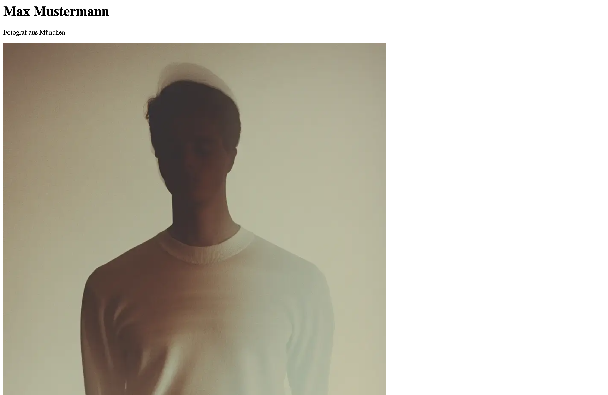
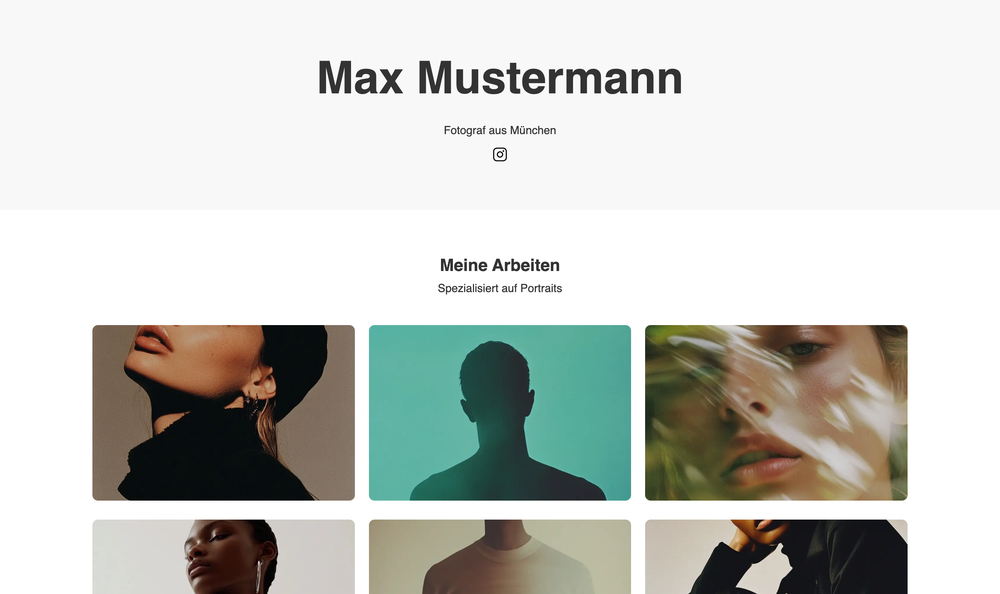
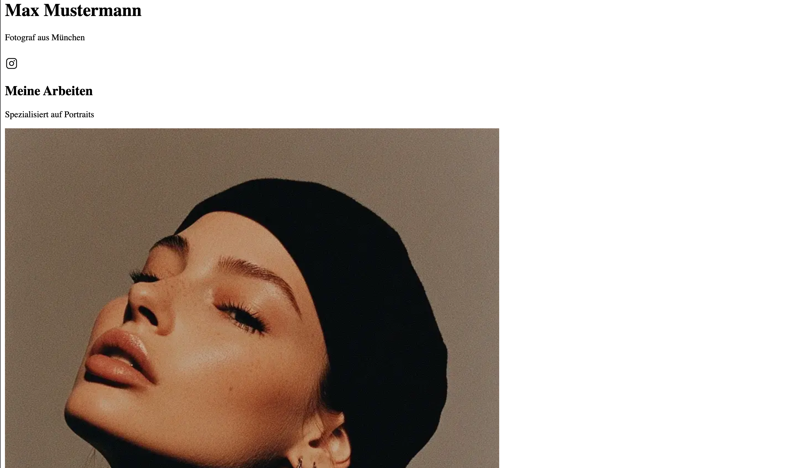

## Warum der Exkurs, wenn wir Framer nutzen?

Mit Tools wie Framer, Webflow und co, musst du für dein Portfolio keine Zeile Code schreiben. Trotzdem lohnt sich ein Blick darauf, was dabei im Hintergrund passiert:

- Framer erzeugt das, was wir in der heutigen Stunde von Hand bauen: HTML, CSS und JavaScript
- Wenn in Framer etwas nicht so aussieht wie geplant, verstehst du eher, woran es liegen kann
- Du verstehst und kannst dich besser mit Entwicklern oder Dritten über das Thema sprechen
- Wer später mehr will, hat den Einstieg schon gemacht

**Format dieser Einheit:**  
Ich zeige den Code live. Mitmachen ist freiwillig. Wer möchte, öffnet die CodeSandbox-Links und tippt mit.

---

## Blick unter die Haube: DevTools

Jede Website besteht aus HTML, CSS und JavaScript. Das lässt sich in jedem Browser nachprüfen:

1. Beliebige Website öffnen (z.B. eine mit Framer gebaute Seite)
2. Rechtsklick auf ein Element → **Untersuchen** (Inspect)
3. Links steht die HTML Struktur, rechts das zugehörige CSS

Was du dort siehst, ist genau das, was wir heute selbst schreiben.

---

## Zur Erinnerung: Die drei Säulen des Webs

### HTML - Die Struktur

- Definiert den Inhalt
- Überschriften, Absätze, Bilder, Links
- Wie das Gerüst eines Hauses

### CSS - Das Aussehen
- Definiert das Design
- Farben, Schriften, Layout, Animationen
- Wie die Inneneinrichtung eines Hauses

### JavaScript - Die Interaktion

- Definiert das Verhalten
- Buttons, Formulare, dynamische Inhalte
- Wie die Elektronik eines Hauses

---

## Vom Figma-Design zum Code

Vieles aus Figma hat eine direkte Entsprechung im Code:

| Figma | Code |
|---|---|
| Frame | `<div>`, `<section>`, `<header>` |
| Auto Layout | CSS Flexbox / Grid |
| Komponente | Wiederverwendbarer HTML-Block |
| Styles & Variablen | CSS-Variablen |
| Breakpoints | Media Queries |
| Prototyp-Link | `<a href="...">` |

---

## HTML Beispiel

```html
<!DOCTYPE html>
<html>
<head>
    <title>Mein Portfolio</title>
</head>
<body>
    <h1>Max Mustermann</h1>
    <p>Fotograf aus München</p>
    
</body>
</html>
```

**Das sieht der Browser:**

- Große Überschrift: "Max Mustermann"
- Text darunter: "Fotograf aus München"
- Ein Bild namens "portrait.jpg"



[](https://codesandbox.io/p/sandbox/vs8s3z)

---

## CSS Beispiel

```css
h1 {
  color: #333;
  font-size: 48px;
  font-family: 'Helvetica', sans-serif;
}

p {
  color: #666;
  font-size: 18px;
  line-height: 1.5;
}

img {
  width: 300px;
  border-radius: 10px;
}
```

**Jetzt wird aus der langweiligen HTML-Seite:**
- Schöne Schrift und Farben
- Größere, lesbare Texte
- Abgerundete Bildecken


---

## Praxis: Unsere erste HTML/CSS Seite

**Wir erstellen gemeinsam:**
- Eine simple Portfolio-Startseite
- Mit HTML-Struktur
- Mit CSS-Styling
- Responsive Grundlagen

**Du lernst dabei:**
- Wie Code und Darstellung zusammenhängen
- Warum Framer/Webflow im Hintergrund ähnlich arbeiten
- Das Fundament aller Websites

[](https://codesandbox.io/p/sandbox/5l9nfp)



---

## HTML Grundstruktur

```html
<!-- index.html -->

<!DOCTYPE html>
<html lang="de">
	<head>
		<meta charset="UTF-8" />
		<meta name="viewport" content="width=device-width, initial-scale=1.0" />
		<title>Max Mustermann - Fotograf</title>
	</head>
	<body>
		<!-- Header-Bereich mit Name und Beruf und Instagram -->
		<header>
			<h1>Max Mustermann</h1>
			<p>Fotograf aus München</p>

			<a
				href="https://instagram.com/d.tampe"
				target="_blank"
				style="margin-top: 10px; display: inline-block"
			>
				
			</a>
		</header>

		<!-- Hauptinhalt der Seite -->
		<main>
			<section class="portfolio">
				<h2>Meine Arbeiten</h2>
				<p>Spezialisiert auf Portraits</p>

				<!-- Bildergalerie mit 6 Beispielbildern -->
				<div class="gallery">
					<div class="gallery-item">
						
					</div>
					<div class="gallery-item">
						
					</div>
					<div class="gallery-item">
						
					</div>
					<div class="gallery-item">
						
					</div>
					<div class="gallery-item">
						
					</div>
					<div class="gallery-item">
						
					</div>
				</div>
			</section>
		</main>
	</body>
</html>
```



---

## CSS Styling hinzufügen

 Um die Webseite ansprechend zu gestalten und die Bilder optimal anzuordnen, stylen wir die Seite mit CSS. Dies umfasst die Implementierung einer Galerie mit drei Spalten, in der die Bilder gleichmäßig hoch dargestellt werden. Dafür muss die Datei `style.css` erstellt werden und auch in die `index.html` Datei eingebunden werden.

```html
<!-- index.html -->
<head>
	<meta charset="UTF-8" />
	<meta name="viewport" content="width=device-width, initial-scale=1.0" />
	<title>Max Mustermann - Fotograf</title>
	<link rel="stylesheet" href="style.css" /> <!-- <- Diese Zeile -->
</head>
<body>
<!-- [...] -->
```

```css
/* style.css */

/* Reset: Entfernt Browser-Standard-Styles */
* {
  margin: 0;
  padding: 0;
  box-sizing: border-box;
}

/* Grundlegende Body-Styles */
body {
  font-family: -apple-system, sans-serif;
  line-height: 1.6;
  color: #333;
}

/* Header-Styling mit grauem Hintergrund */
header {
  padding: 60px 20px;
  text-align: center;
  background-color: #f8f8f8;
}

/* Große Hauptüberschrift */
h1 {
  font-size: 3rem;
  margin-bottom: 10px;
}

/* Portfolio-Sektion mit begrenzter Breite und zentriert */
.portfolio {
  padding: 60px 20px;
  max-width: 1200px;
  margin: 0 auto;
  text-align: center;
}

/* Bildergalerie als CSS Grid */
.gallery {
  display: grid;
  grid-template-columns: repeat(3, 1fr); /* 3 Spalten auf Desktop */
  gap: 20px; /* Abstand zwischen den Bildern */
  margin-top: 40px;
}

/* Styling für die Galerie-Bilder */
.gallery-item img {
  width: 100%; /* Bild füllt Container aus */
  height: 250px; /* Feste Höhe für einheitliches Raster */
  object-fit: cover; /* Bild wird zugeschnitten, behält Proportionen */
  border-radius: 8px; /* Abgerundete Ecken */
  transition: transform 0.3s ease; /* Weiche Animation für Hover-Effekt */
}
```


---

## Responsive Verhalten hinzufügen

Damit unsere Website auch auf allen Geräten gleich gut aussieht, müssen wir nun noch so genannte Media-Queries hinzufügen. Das ist in dem CodeSandbox Link bereits gemacht worden.

[](https://codesandbox.io/p/sandbox/k89xxr)

```css
/* style.css */

/* Tablet-Ansicht: 2 Spalten statt 3 */
@media (max-width: 768px) {
  h1 {
    font-size: 2rem; /* Kleinere Überschrift */
  }

  header {
    padding: 40px 15px; /* Weniger Padding */
  }

  .portfolio {
    padding: 40px 15px;
  }

  .gallery {
    grid-template-columns: repeat(2, 1fr); /* 2 Spalten auf Tablet */
    gap: 15px; /* Kleinerer Abstand */
  }
}

/* Mobile-Ansicht: 1 Spalte */
@media (max-width: 480px) {
  .gallery {
    grid-template-columns: 1fr; /* Nur 1 Spalte auf Mobile */
    gap: 15px;
  }

  .gallery-item img {
    height: 200px; /* Kleinere Bildhöhe auf Mobile */
  }
}

/* Sehr große Bildschirme: Noch größere Überschrift */
@media (min-width: 1200px) {
  h1 {
    font-size: 4rem;
  }
}
```

**Test:** Browserfenster kleiner/größer ziehen

---

## Bonus: Interaktivität hinzufügen (Lightbox)

**Was ist eine Lightbox?**
- Bild wird beim Klick groß angezeigt
- Overlay über der Seite
- Schließen durch Klick ins Dunkle

**Wir lernen:**
- Wie JavaScript mit HTML interagiert
- Event Listener für Klicks
- CSS-Klassen dynamisch hinzufügen/entfernen

[](https://codesandbox.io/p/sandbox/k89xxr)

Die einfachste Möglichkeit, Interaktivität hinzuzufügen, besteht darin, eine CSS-Transition für Effekte wie Mouse Over oder Hover zu verwenden.

```css
/* style.css */

/* Hover-Effekt: Bild wird leicht vergrößert */
.gallery-item img:hover {
  transform: scale(1.05);
}
```

Um die Seite noch interaktiver zu gestalten, habe ich einen kleinen Bonus vorbereitet. Wir fügen eine Lightbox hinzu. Das bedeutet, wenn man auf ein Bild klickt, wird es mittig groß über anderen Inhalten angezeigt.

```css
/* lightbox.css */

/* Lightbox Overlay - zunächst versteckt */
.lightbox {
  position: fixed;
  top: 0;
  left: 0;
  width: 100vw;
  height: 100vh;
  background: rgba(0, 0, 0, 0.8);
  display: none; /* versteckt */
  justify-content: center;
  align-items: center;
}

/* Bild in der Lightbox */
.lightbox img {
  max-width: 90%;
  max-height: 90%;
  border-radius: 6px;
}

/* Sichtbar machen mit der Klasse "show" */
.lightbox.show {
  display: flex;
}
```

Wir müssen die neue CSS Datei natürlich auch wieder in unserem HTML referenzieren. Darüber hinaus fügen wir kurz vor dem Ende vor dem Endtag `</body>` in der HTML noch weitere Zeilen hinzu, die sowohl ein neues Script referenziert und auch die HTML Struktur für die Lightbox schafft.

```html
<!-- index.html -->
<head>
	<meta charset="UTF-8" />
	<meta name="viewport" content="width=device-width, initial-scale=1.0" />
	<title>Max Mustermann - Fotograf</title>
	<link rel="stylesheet" href="style.css" />
	<link rel="stylesheet" href="lightbox.css" /> <!-- <- Diese Zeile für das Lightbox CSS -->
</head>
<body>
	<!-- [...] -->

	<!-- START CODE BLOCK -->
	<div class="lightbox" id="lightbox">
		
	</div>
	<script src="script.js" defer></script>
	<!-- ENDE CODE BLOCK -->
</body>
```

Wir legen eine neue Datei an: `script.js`. Wie vorher erwähnt können wir mit Javascript Webseiten Interaktivität hinzufügen. Die Kommentare im Script erläutern die einzelnen Schritte.

```js
// script.js

// Das Lightbox-Element (Overlay) aus dem HTML auswählen
const lightbox = document.getElementById('lightbox')
// Das Bild innerhalb der Lightbox auswählen
const lightboxImg = lightbox.querySelector('img')

// Alle Bilder innerhalb der Galerie auswählen
document.querySelectorAll('.gallery-item img').forEach((element) => {
  // Für jedes Bild einen Klick-Listener hinzufügen
  element.addEventListener('click', () => {
    // Wenn man auf ein Bild klickt:

    // 1. Die Bildquelle (src) in das Lightbox-Bild übernehmen
    lightboxImg.src = element.src

    // 2. Auch den Alt-Text übernehmen (für Barrierefreiheit)
    lightboxImg.alt = element.alt

    // 3. Die Lightbox sichtbar machen, indem wir die CSS-Klasse "show" hinzufügen
    lightbox.classList.add('show')
  })
})

// Klick-Event für die Lightbox selbst
// -> Wenn man irgendwo ins Overlay klickt (nicht auf das Bild), wird sie wieder geschlossen
lightbox.addEventListener('click', () => {
  // Die CSS-Klasse "show" entfernen, damit die Lightbox verschwindet
  lightbox.classList.remove('show')
})
```

Unser finale Code sollte dann so aussehen:
[](https://codesandbox.io/p/sandbox/03-02-praxis-g468h5)

---

## Roadmap: Webentwicklung


[Bildquelle](https://roadmap.sh/frontend)

### Empfohlener Lernpfad

```
Für Frontend: HTML & CSS → JavaScript → Framework (React/Vue/Svelte)
Für Full-Stack: HTML & CSS → PHP → JavaScript
```

### Ressourcen

| Thema             | Kostenlose Ressourcen                  |
| ----------------- | -------------------------------------- |
| **HTML/CSS**      | freeCodeCamp, MDN Web Docs, CSS-Tricks |
| **JavaScript**    | freeCodeCamp, Youtube                  |
| **React**         | React.dev (offizielle Doku), Youtube   |
| **Vue**           | Vue.js Guide, Vue Mastery, Youtube     |
| **PHP + Laravel** | Youtube, Laravel Doku                  |

Alternativ hier reinschauen für einen Überblick und Resourcen: https://roadmap.sh/frontend

### Praktische Empfehlungen

- **Editor:** Visual Studio Code (kostenlos) oder Code-Sandbox
- **Übung:** Kleine Projekte bauen (Portfolio, Lebenslauf, To-Do-App)

### Warum ein Framework lernen?

- Für WebApps perfekt geeignet, da komplexe Interfaces einfacher damit zu bauen sind
- Für Marketing Webseiten trotzdem gut geeignet, auch wenn nicht zwingend notwendig
- Wiederverwendbare Komponenten
- Großer Arbeitsmarkt für Entwickler

---

## Weiterführende Links:

- [HTML einfach verstehen](https://www.schulhomepage.de/webdesign/html)
- [Einstieg in HTML](https://wiki.selfhtml.org/wiki/Einstieg_in_HTML)
- [Einstieg in CSS](https://wiki.selfhtml.org/wiki/Einstieg_in_CSS)
