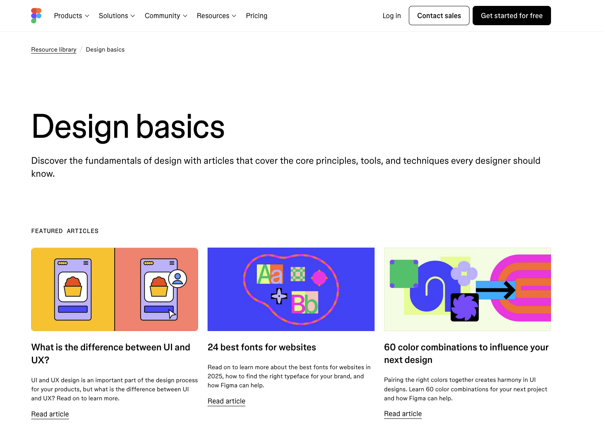
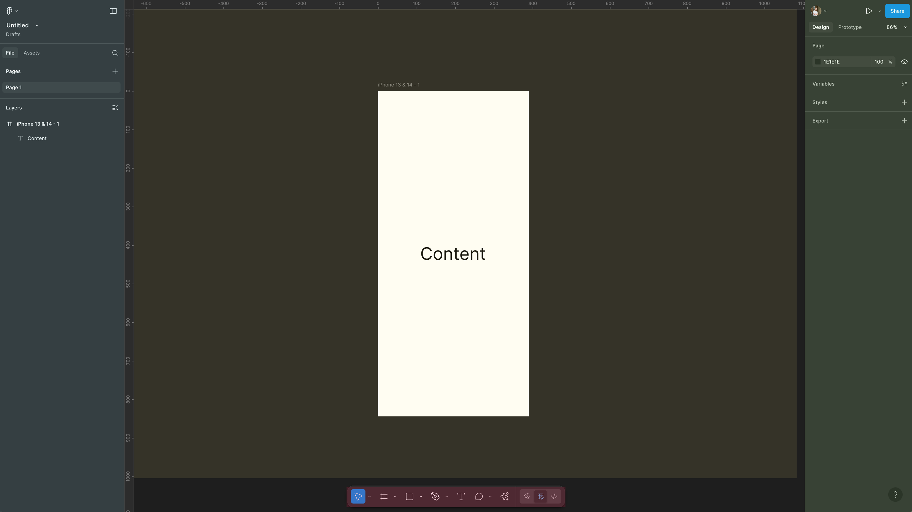
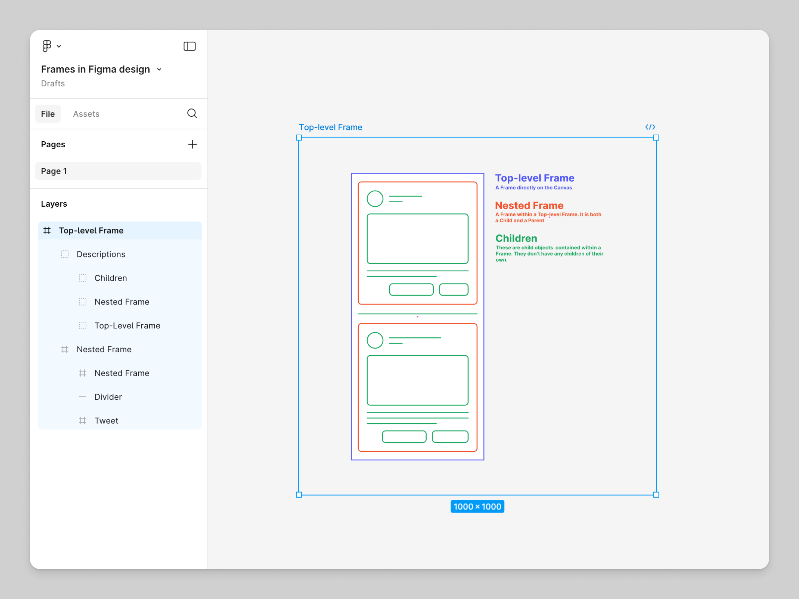
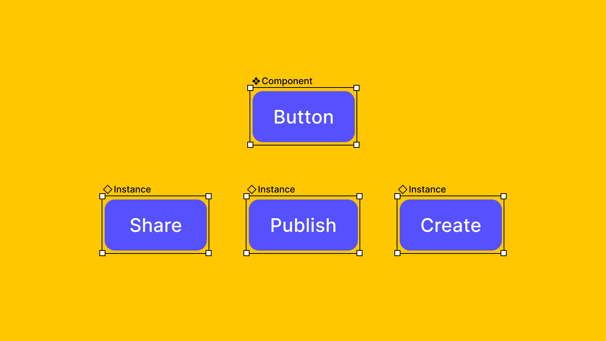
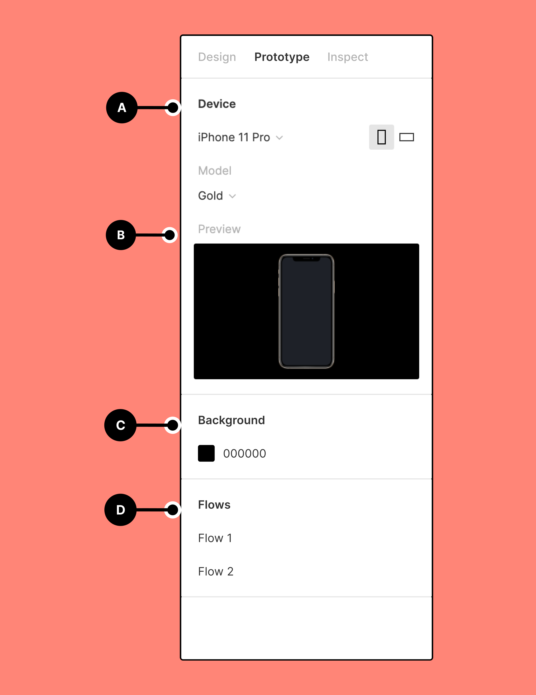
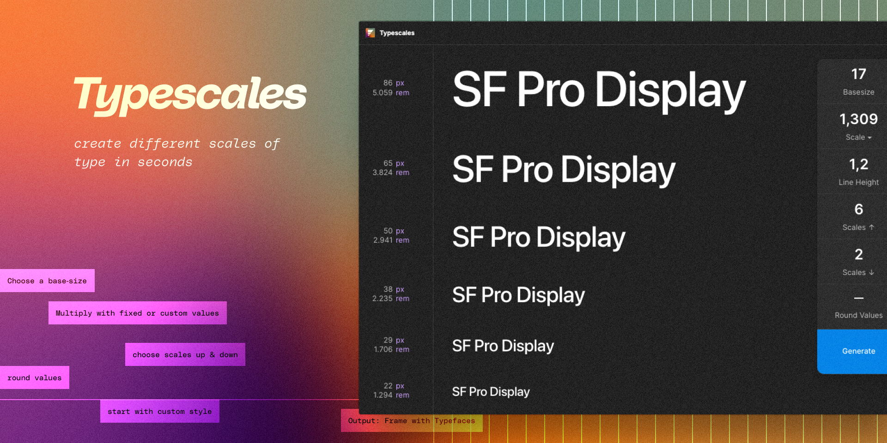
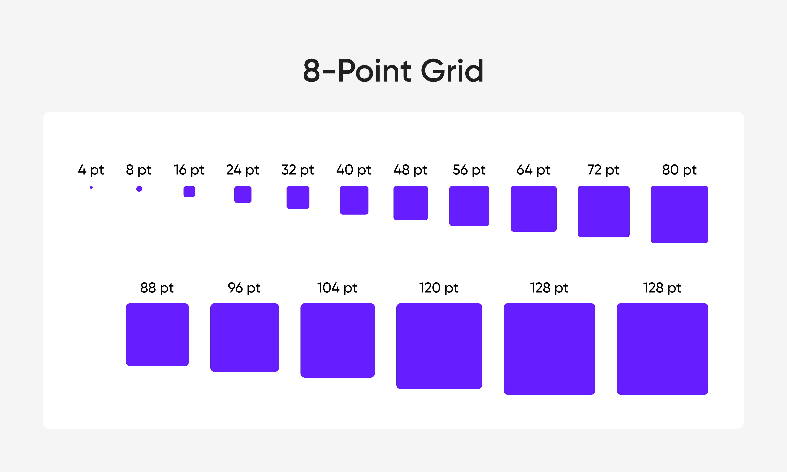
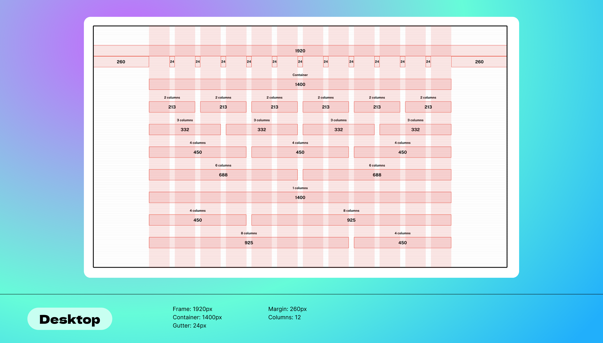

## Warum Figma?

**Figma ist der Industry-Standard für UI/UX Design**

- Browserbasiert, keine Installation nötig
- Kollaboratives Arbeiten in Echtzeit
- Kostenlose Version ausreichend für Portfolios
- Direkter Export zu Framer möglich
- Ähnliche Bedienung wie Framer

---

## Figma Produkte

**Figma bietet mehrere kollaborative Produkte an, die neben UI/UX Design interessant sind**

- Figma Design (Design & Prototypen)
- Dev Mode (Designs in Code übersetzen)
- FigJam (Whiteboard, ähnliche wie Miro)
- Figma Slides (Präsentationen)
- Figma Sites (Beta, Website Builder)
- Figma Buzz (Beta, Markenkonforme Assets produzieren)

---

## Die Figma Dokumentation

Figma ist zu komplex für rein frontale Vermittlung, daher empfehle ich folgende Ressourcen um Figma zu "wirklich" zu lernen.

- [figma.com/resources/learn-design](https://www.figma.com/resources/learn-design/)
- [help.figma.com](https://help.figma.com/hc/en-us/categories/360002051613)
- [YouTube: Moritz Ceglarek - Figma Tutorial für Anfänger auf Deutsch (Schritt-für-Schritt)](https://www.youtube.com/watch?v=YtLbCASJAL0)
- [Youtube: Juxtopposed - world's shortest Figma course](https://www.youtube.com/watch?v=1pW_sk-2y40)
- Figma-Community: Kostenlose Templates und Tutorials

Die Dokumentation ist auf Englisch, aber sehr verständlich mit Videos ergänzt.

---

## Interface-Überblick

**Hauptbereiche:**

**Links (Blau): Layers Panel, Komponenten, Seiten** 
- Alle Elemente hierarchisch organisiert
- Komponenten Übersicht
- Seiten

**Mitte (Gelb): Canvas**
- Ihr Arbeitsbereich
- (Quasi) Unendliches Canvas

**Rechts (Grün): Properties Panel**
- Eigenschaften des ausgewählten Elements
- Prototype Play
- Teilen

**Unten Mitte (Rot): Toolbar**
- Werkzeuge und Aktionen

---

## Frames

**Wofür sind Frames gedacht?**
Frames sind Container für Ihr Design – denken Sie an Artboards in anderen Design-Tools.

**Verwendung:**
- Definieren Sie Bildschirmgrößen (Desktop: 1920px, Mobile: 375px)
- Jede Seite Ihrer Website ist ein Frame
- Frames können verschachtelt werden
- Haben eigene Eigenschaften (Hintergrund, Radius, Schatten)

**Frames sind die Grundlage für responsive Designs und Prototypen.**

[Bild Quelle](https://help.figma.com/hc/en-us/articles/360041539473-Frames-in-Figma-Design)

---

## Gruppen

**Wofür sind Gruppen gedacht?**
Gruppen organisieren mehrere Elemente ohne eigene visuelle Eigenschaften.

**Frames vs. Gruppen**
Frames dienen als strukturierte Container, die Funktionen wie Auto Layout, Constraints und responsive Design-Verhalten unterstützen, während Gruppen hauptsächlich zur einfachen Organisation von Elementen ohne diese fortgeschrittenen Funktionen dienen.

Frames dienen als strukturierte Container, die Funktionen wie Auto Layout, Constraints und responsive Design-Verhalten unterstützen, während Gruppen hauptsächlich zur einfachen Organisation von Elementen ohne diese fortgeschrittenen Funktionen dienen.

**Verwendung:**
- Mehrere Elemente zusammenfassen für einfacheres Handling
- Größe passt sich automatisch dem Inhalt an
- Keine Layout-Kontrolle wie bei Frames

---

## Auto Layout

**Wofür ist Auto Layout gedacht?**
Auto Layout macht Frames flexibel und responsive – Elemente ordnen sich automatisch an und passen sich an.

**Eigenschaften:**
- Direction: Horizontal oder Vertikal stapeln
- Spacing: Abstände zwischen Elementen
- Padding: Innenabstände
- Alignment: Ausrichtung

**Auto Layout ist essentiell für Designs, die später in Framer umgesetzt werden.**

Weitere Infos zu Auto Layouts: https://help.figma.com/hc/de/articles/360040451373-Leitfaden-zum-Auto-Layout

[Bild Quelle](https://help.figma.com/hc/de/articles/360040451373-Leitfaden-zum-Auto-Layout)

---

## Komponenten

**Wofür sind Komponenten gedacht?**
Komponenten sind wiederverwendbare Design-Elemente – einmal erstellen, überall nutzen, zentral ändern. Man kann auch Varianten von Komponenten erstellen.

**Verwendung:**
- Buttons
- Navigation
- Wiederkehrende Elemente
- Footer: Konsistent auf allen Seiten

**Vorteile:**
- Änderung an einer Stelle = Änderung überall
- Konsistentes Design garantiert
- Schnelleres Arbeiten

**In Framer werden aus Figma-Komponenten oft direkt funktionale Elemente.**

[Bild Quelle](https://help.figma.com/hc/de/articles/360039150173-Komponenteninstanzen-erstellen-und-einf%C3%BCgen)

---

## Variablen & Styles

**Wofür sind Variablen und Styles gedacht?**
Zentrale Definition von Design-Tokens, die im gesamten Design wiederverwendet werden – eine Änderung, überall wirksam.

**Verwendung:**
- Farben, Gradients, etc.
- Schriften (z.B. H1-H6, sm, xs)
- Abstände, Breiten, Höhen
- Später in Framer direkt übertragbar

**Variables und Styles sind die Grundlage für Design Systems.**

Mehr Informationen: https://help.figma.com/hc/en-us/articles/15339657135383-Guide-to-variables-in-Figma

---
## Prototyping-Modus

**Wofür ist der Prototyping-Modus gedacht?**
Im Prototyping-Modus können Sie Interaktionen und Übergänge zwischen Seiten definieren – ohne Code.

**Verwendung:**
- Navigation testen: Von Startseite zu Portfolio
- Hover-States zeigen
- Mobile-Menü öffnen/schließen
- Scroll-Verhalten simulieren

**Bedienung:**
- Rechts oben: Von "Design" zu "Prototype" wechseln
- Elemente verbinden durch Ziehen
- Interaktionen definieren (Click, Hover, etc.)

**Für Ihre Zwischenabgabe können Sie so Ihr Design interaktiv präsentieren.**

[Bild Quelle](https://help.figma.com/hc/de/articles/360040314193-Einf%C3%BChrung-in-Prototyping-in-Figma)

---

##  Typografie (und Typescales)

[Bild Quelle](https://www.figma.com/community/plugin/739825414752646970/typescales)

**Wofür sind Typescales gedacht?**
Typescales definieren ein konsistentes System von Schriftgrößen für Ihre gesamte Website.

**Typische Hierarchie:**
- H1: 48-72px (Hauptüberschrift)
- H2: 36-48px (Sektionsüberschriften)
- H3: 24-32px (Untertitel)
- Body: 14-18px (Fließtext)
- Small: 12-14px (Footer, Captions)

**Basics mit Typescales:**
1. Basis-Schriftgröße festlegen (z.B. 16px)
2. Faktor auswählen (z.B. 1.333 (Perfect Fourth))
3. Profit.

**Tipps:**
- Definieren Sie 4-6 Größen, nicht mehr
- Verhältnis zwischen Größen beachten (z.B. 1.5x Faktor)
- Text Styles in Figma anlegen für Konsistenz
- Überspringen von einer Schriftgröße hilft visuell oft bei der Unterscheidung der Größen
- Einen Basis-Schriftschnitt nehmen und dann max. einen fetteren und einen dünneren.
- Auch hier macht das überspringen eines Mittelschnitts oft visuell Sinn. Wenn also z.b. der Basisschnitt "Normal - 400" ist, dann nehmen wir "Fett - 600" oder "Fett - 700" und ggf. "Thin - 200". Das hängt aber auch immer stark von der Schriftart ab.

Figma Plugin Typescales: https://www.figma.com/community/plugin/739825414752646970/typescales
Web Tool: https://typescale.com/

---
## Abstände: 4pt/8pt Grid

[Bild Quelle](https://cieden.com/book/sub-atomic/spacing/choosing-a-spacing-system)

**Wofür ist ein Spacing-System gedacht?**
Ein konsistentes Abstandssystem sorgt für visuellen Rhythmus und erleichtert responsive Umsetzung.

**Zwei gängige Systeme:**

**4pt Grid:** Alle Abstände sind Vielfache von 4px: 4, 8, 12, 16, 20, 24, 32, 40, 48...
- Feinere Kontrolle für Details
- Ideal für Icons, kleine Elemente

**8pt Grid:** Alle Abstände sind Vielfache von 8px: 8, 16, 24, 32, 40, 48, 64, 80...
- Schnellere Entscheidungen
- Standard in vielen Design Systems

**Vorteile:**
- Schnellere Designentscheidungen
- Konsistentes Erscheinungsbild
- Einfachere Kommunikation mit Entwicklern

---
## Layout: 12 Grid

[Bild Quelle](https://www.figma.com/community/file/1450936962822293368)

**Wofür ist das 12er Grid gedacht?**
Das 12-Spalten-Grid ist der Standard für responsive Webdesign und hilft bei der Ausrichtung von Inhalten.

**Warum 12 Spalten?**
- Flexibel teilbar: 2, 3, 4, 6 Spalten möglich
- Standard in den meisten CSS-Frameworks
- Erleichtert responsive Anpassungen

---
## Breakpoints

**Was sind Breakpoints?**
Breakpoints definieren, bei welchen Bildschirmbreiten sich Ihr Layout anpasst – essentiell für responsive Design.

**Standard Breakpoints:**
- **Desktop:** 1920px
- **Laptop:** 1440px (Design-Breite)
- **Tablet:** 768px
- **Mobile:** 390px (iPhone Standard)

**Verwendung in Figma:**
- Erstellen Sie Frames für mindestens Laptop und Mobile
- Navigation: Horizontal → Hamburger-Menü
- z.b. im Grid: 3 Spalten → 2 Spalten → 1 Spalte

**In Framer werden diese Breakpoints später für Media Queries genutzt.**

---

## Praxis & Hausaufgabe

**Portfolio-Design in Figma beginnen (Desktop-Version)**

- Desktop Frame: 1440px oder 1512px Breite
- Eigene Inhalte verwenden falls vorhanden
- Versuchen Sie ein Auto Layout für die Navigation zu verwenden
- Mindestens eine Komponente erstellen (z.b. Button)

**Optional:**
- Weitere Unterseiten designen
- Prototype-Links zwischen Seiten
- Mobile-Version (375px) beginnen