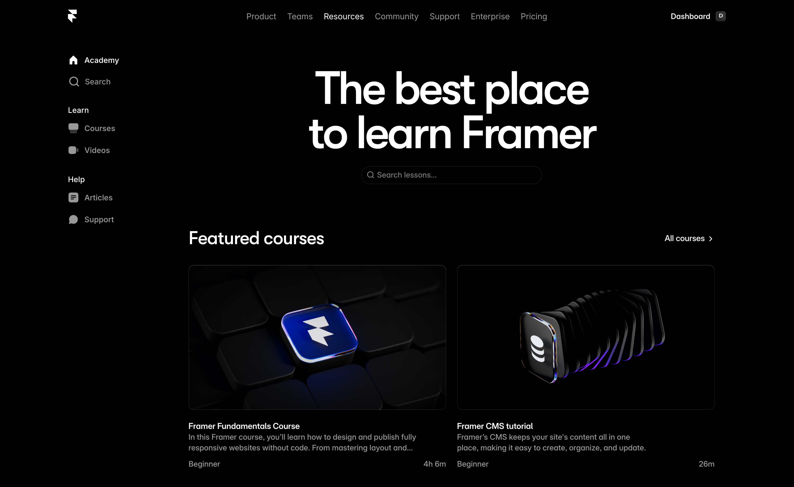
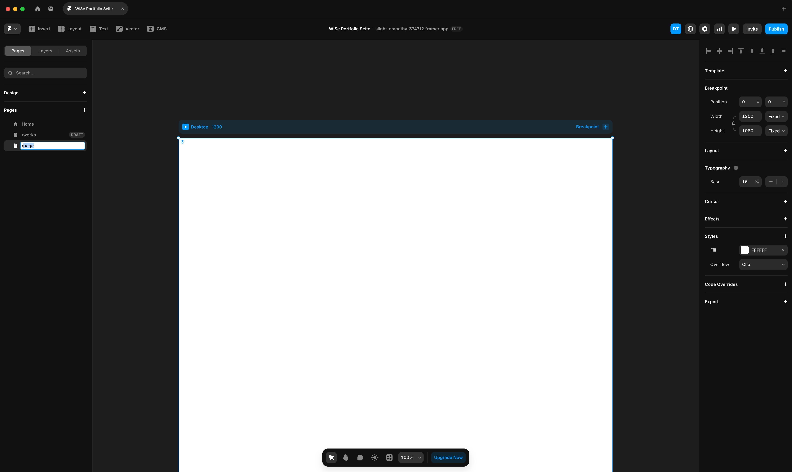
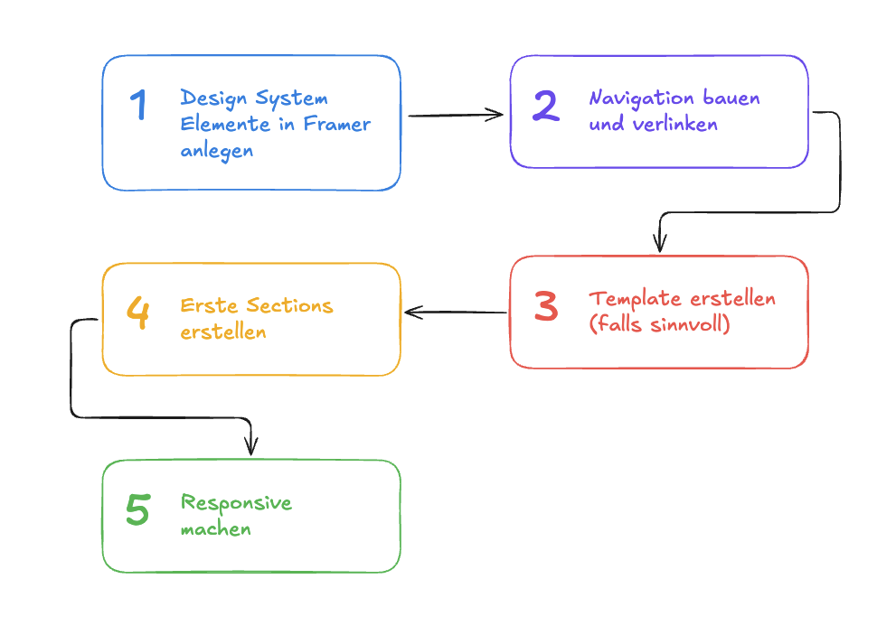
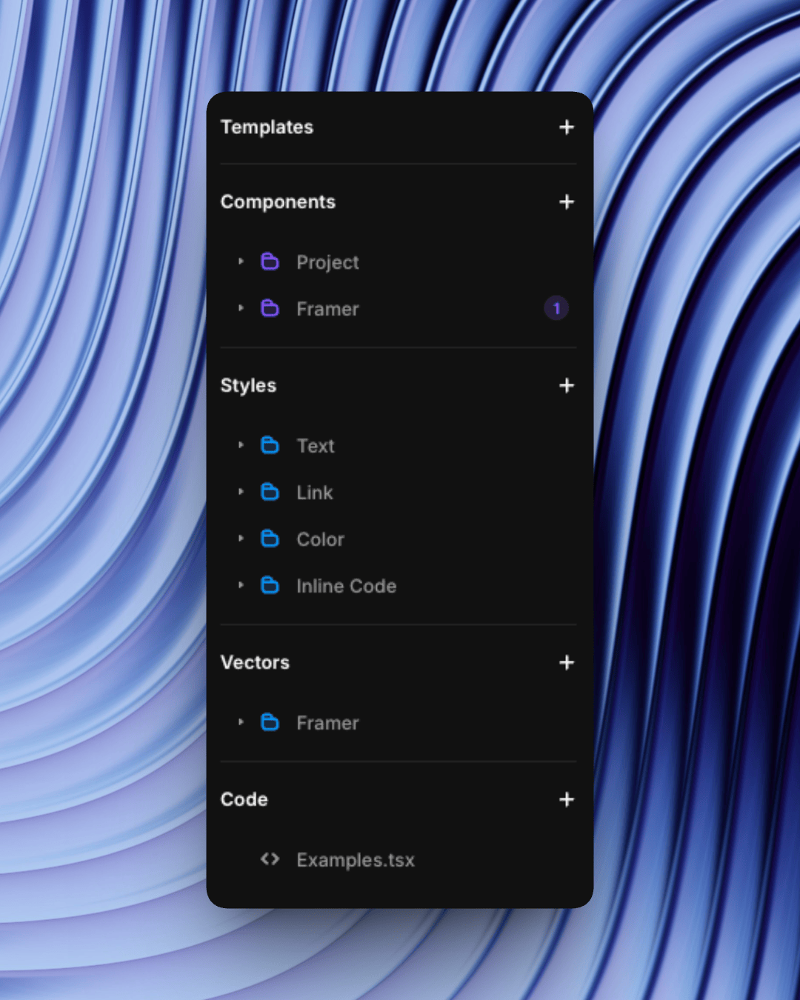
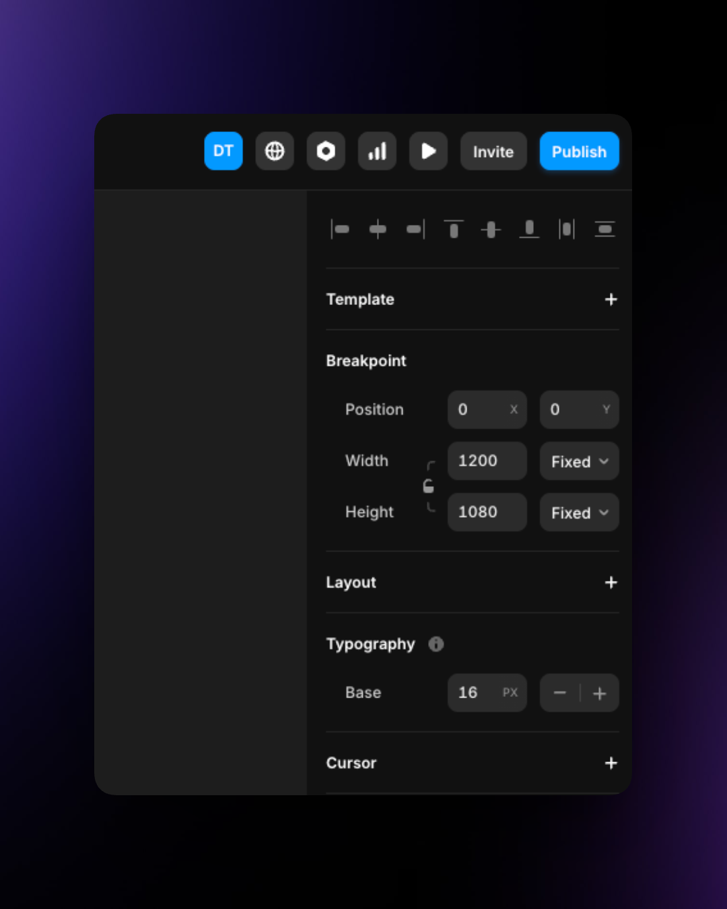
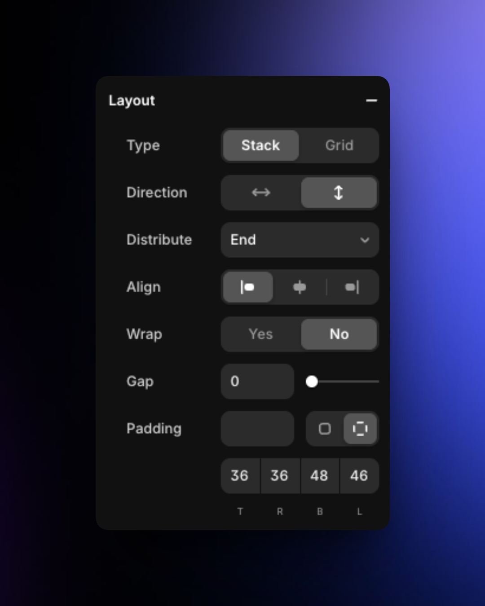
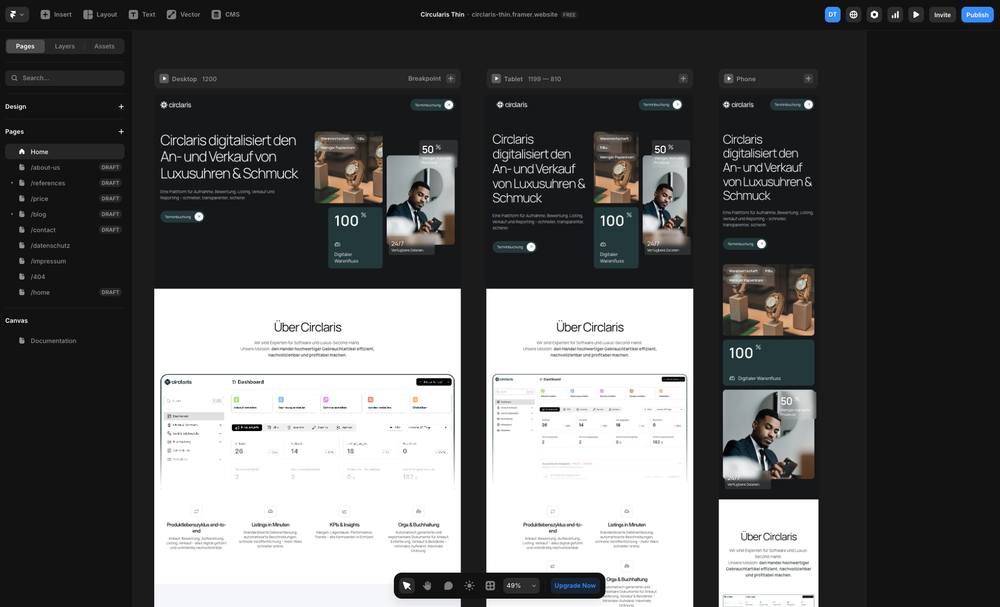
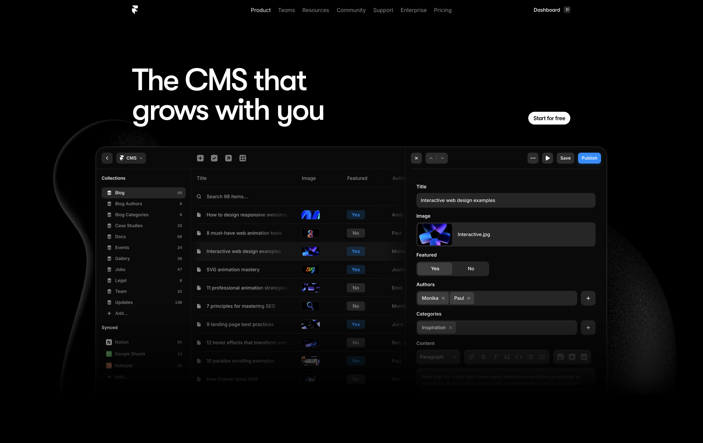

## Warum Framer?

Framer ist kein ausschließlicher No-Code Website-Builder sondern auch ein Design Tool. 

*"Warum haben wir dann Figma gelernt?"*
Weil es ein Industriestandard für UI Design ist und Sie damit breiter aufgestellt sind.

Framer bietet aber und eignet sich besonders gut:
- Direkten Import aus Figma (in einigen Fällen)
- Integriertes Hosting
- Portfolios, Marketing Seiten
- Kein Code nötig (aber möglich und mit React da auch sehr mächtig)

---
## Wann nicht Framer?

- Wenn Sie Backend Funktionalitäten brauchen (z.b. eine extra Datenbank, komplexe Business-Logic)
- Bei sehr komplexen Webseiten mit bsp. Mitglieder Funktionalitäten, o.Ä.
- Web-Apps

---
## Die Framer Dokumentation

Framer ist auch etwas zu komplex für eine rein frontale Vermittlung. Daher empfehle ich folgende Ressourcen:

- [Framer Academy](https://www.framer.com/academy/)
- [YouTube: Flux Academy - # Learn Framer for Beginners (2025 Crash Course)](https://www.youtube.com/watch?v=03f3294jzis)
- [Youtube: Framer University - framer tutorial: building your portfolio website](https://www.youtube.com/watch?v=yyh-1_mPlMY)

Die Dokumentation ist auf Englisch, aber sehr verständlich und mit vielen Videos.

---
## Interface: Ähnlichkeiten zu Figma

**Das meiste kennen Sie schon**

- Canvas, Layers Panel, Properties Panel
- Frames, Auto Layout (heißt hier Stack), Komponenten
- Shortcuts funktionieren ähnliche

**Neu in Framer:**

- Breakpoint-Switcher (oben in der Toolbar)
- Assets Panel für Bilder
- Preview zeigt echte Website
- Pages Panel für Seitenstruktur

Wenn Sie Figma können, finden Sie sich schnell zurecht.

---

## Der Workflow: Übersicht

1. Design System aufsetzen (Variables, Styles, Breakpoints)
2. Navigation bauen und verlinken
3. Template erstellen (falls sinnvoll)
4. Erste Sections erstellen
5. Responsive machen

Jeder Schritt baut mehr oder weniger auf dem vorherigen auf.

---

## Schritt 1: Design System aufsetzen

**Warum zuerst?** Wenn Sie später Farben oder Schriften ändern wollen, ändern Sie es einmal statt 50x.

**Variables anlegen:**

- Assets Panel öffnen
- Colors: Primary, Background, Text
- Text-Styles: H1, H2, Body, Small (Schriftart, Größe, Zeilenhöhe definieren)
- Links
- Blockquotes

**Breakpoints in Text-Styles prüfen:**
- Desktop (1200px+), Tablet (768-1199px), Mobile (0-767px)
- Sind standardmäßig da, können aber angepasst werden

---

## Schritt 2: Navigation bauen

**Falls Sie die Navigation bereits in Figma haben:**
1. Navigation in Figma auswählen
2. Plugin "Figma to Html" öffnen
3. In Framer einfügen
4. Als Komponente speichern

**Oder manuell bauen:**
- Stack erstellen (horizontal)
- Text-Elemente für Menüpunkte
- Abstände mit Variables
- Als Komponente speichern (Cmd/Ctrl + Alt + K)

Die Komponente können Sie später auf jeder Seite wiederverwenden oder in ein Template einbauen.

---

## Schritt 3: Template erstellen

Ein Grundlayout das Seiten zugewiesen werden kann. Fügt dann allen Seiten die Struktur des Templates hinzu (z.B. Header und Footer)

**Einmal angelegt, überall verwenden**
1. Im Assets Panel Templates erstellen
2. Template editieren und z.B. die Header Komponente hinzufügen
3. Template responsive machen
4. Template einer oder mehreren Seiten zuweisen

---
## Schritt 4: Erste Sections erstellen

**Zwei Wege: Aus Figma kopieren oder neu bauen**

### Option 1: Aus Figma kopieren

Voraussetzung: Ihr Figma-Design muss Auto Layout verwenden.
1. Section in Figma auswählen
2. "Figma to Html"- Plugin öffnen
3. Copy to Clipboard klicken
4. In Framer einfügen (Cmd/Ctrl + V)
5. Framer wandelt Auto Layout automatisch in Stacks um
6. Anpassungen werden trotzdem nötig sein.

Funktioniert nur mit Auto Layout - ohne wird die Section als statisches Element eingefügt.

### Option 2: Manuell in Framer bauen

Falls der Export nicht funktionieren sollte:
1. Frame erstellen (F)
2. In Stack konvertieren (Rechtsklick → Convert to Stack)
3. Stack Properties einstellen:
    - Direction: Vertical
    - Gap: 24px
    - Padding: 80px
    - Max Width: 1200px
4. Elemente hinzufügen (Text, Bilder, Buttons)

Stacks und Grids sind essentiell - ohne Stacks kein Responsive Design.

---

## Schritt 5: Responsive machen

**Jetzt kommt der wichtigste Teil**

1. Breakpoint auf Mobile wechseln (Toolbar oben)
2. Ihre Desktop-Section sehen Sie jetzt in Mobile-Ansicht
3. Anpassungen vornehmen:
    - Stack Direction ändern (z.B. horizontal → vertikal)
    - Schriftgrößen reduzieren
    - Padding anpassen
    - Elemente verstecken (optional)

**Section für Section durchgehen:** Nicht alles auf einmal - jede Section einzeln für Mobile anpassen.

**Preview testen:** Cmd/Ctrl + P öffnet Preview in neuem Tab - testen Sie alle Breakpoints.

---

## Zusammenfassung Workflow

#### Das haben wir gerade gebaut:
Design System → Navigation → Layout / Template → Sections → Responsive

#### Ist diese Reihenfolge immer gleich?
Diese Reihenfolge bietet sich für die meisten Projekte an da 
- Variables und Styles wiederverwendbar sind
- Navigation als Komponente wiederverwendbar sind

#### Wie ist das weitere Vorgehen?
Im Endeffekt wiederholen wir Schritt 4 und Schritt 5 bis wir eine komplette Seite haben. Dann gehen wir zu nächsten Seite, usw.

---
## Tipp: Bilder hochladen

#### Vorbereitung: Exportieren Sie Ihre Bilder aus Lightroom/Photoshop
- 2000-3000px Breite
- JPEG, 80-90% Qualität
- Unter 2MB

#### Optimierung in Framer
Framer konvertiert automatisch zu WebP, erstellt responsive Varianten und aktiviert Lazy Loading. Sie müssen nichts weiter tun.

---
## Tipp: Videos hochladen

#### Lange Videos (mehr als 30-60sek)
Laden Sie diese Videos auf Youtube oder Vimeo hoch um Bandbreite zu sparen und eine bessere Video Experience zu bieten. Sie können die Videos einbetten.

#### Kurze Videos und Clips
- Mit Tools wie Handbrake oder Adobe Media Encoder konvertieren
- Bitrate von 2500 - 6000kbits
- Dateigröße von bis zu 5-7MB pro video max.

---

## Bonus: CMS für Portfolio-Projekte

#### Was ist ein Content-Mangement-System (CMS)?
Ein Content-Management-System (deutsch Inhaltsverwaltungssystem) ist eine Software zur Erstellung, Organisation, Darstellung und Auslieferung digitaler Inhalte
#### Wann macht das CMS Sinn?
Ab 2+ Projekten mit gleicher Struktur.

**So funktioniert's:**

1. CMS Panel → New Collection
2. Felder definieren:
    - Title (Text)
    - Image 1, Image 2, Image ... (Images)
    - Description (Rich Text)
    - Year (Number)
3. Daten eingeben
4. Collection List auf Seite platzieren
5. Ein Item designen → gilt für alle

Neue Projekte hinzufügen = nur Daten eingeben, kein Layout ändern.

https://www.framer.com/cms/