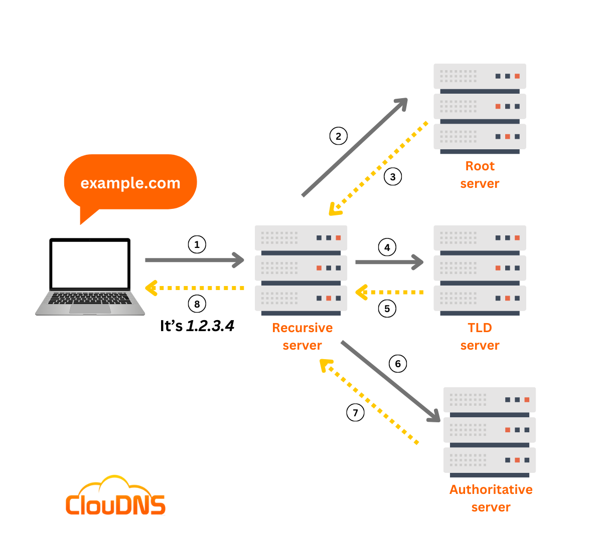
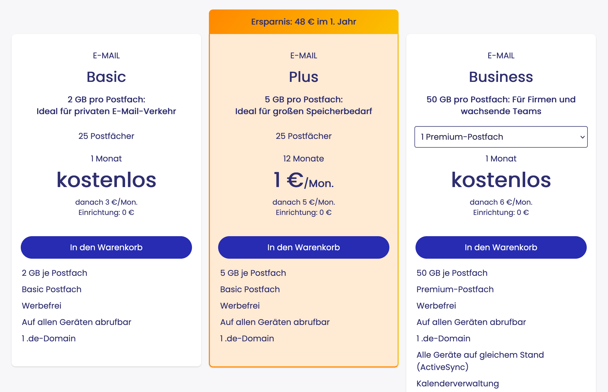
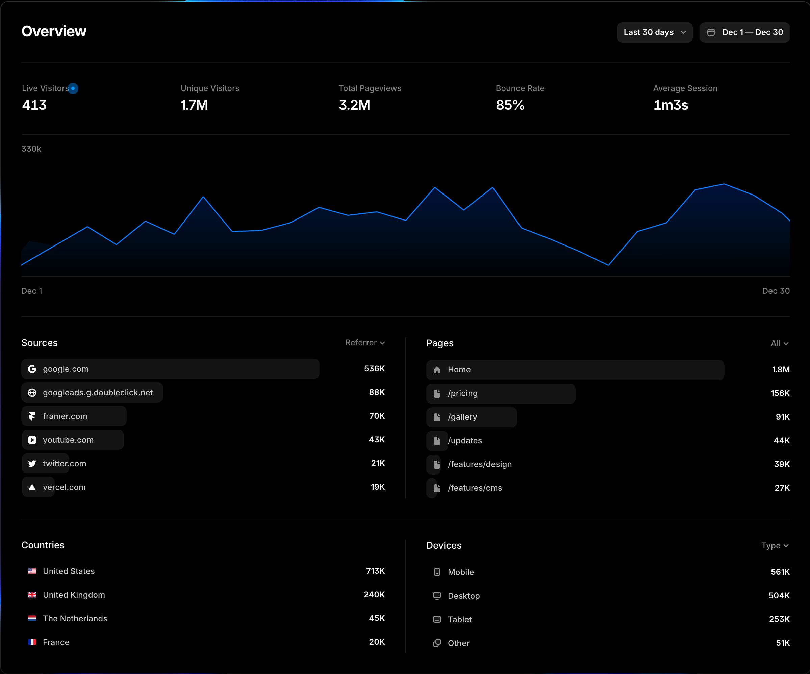
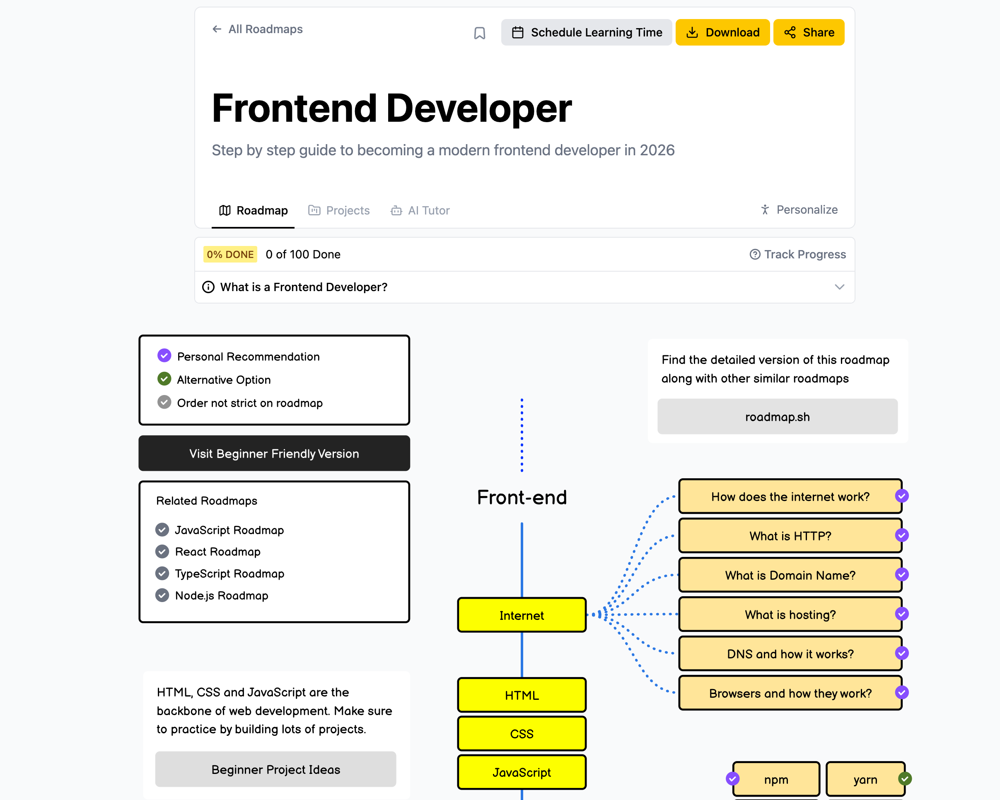

## Domain kaufen / mieten

### Was ist eine Domain?

Eine Domain ist die Adresse deiner Website (z.B. `meinefirma.de`). Sie wird jährlich gemietet, nicht gekauft.

### Bekannte Anbieter

|Anbieter|Vorteile|Preise (ca.)|
|---|---|---|
|**Namecheap**|Günstig, gute Oberfläche, WhoisGuard inklusive|ab 8€/Jahr für .com|
|**IONOS**|Deutscher Support, oft Aktionspreise|ab 1€/Jahr (1. Jahr)|
|**Strato**|Deutsch, Kombi-Pakete mit Hosting|ab 0,50€/Monat|

### Kaufprozess (vereinfacht)

1. Wunschdomain auf Verfügbarkeit prüfen
2. Account erstellen und bezahlen
3. Domain ist sofort verfügbar

**Tipp:** Auf versteckte Kosten bei Verlängerung achten! Manche Anbieter sind z.B. im ersten Jahr sehr günstig, werden dann aber teurer

---

## Domain mit Website verknüpfen (DNS)


[Bildquelle](https://www.cloudns.net/blog/what-is-dns/)
### Variante A: Verknüpfung mit Framer

1. In Framer: **Site Settings → Custom Domain**
2. Domain eingeben und Anweisungen folgen
3. Beim Domain-Anbieter:
    - **CNAME-Record** auf `proxy.framer.app` setzen
    - Oder **A-Records** auf die angegebenen IPs
4. SSL-Zertifikat wird automatisch erstellt

### Variante B: Verknüpfung mit IP-Adresse (Server)

- Im DNS-Bereich des Domain-Anbieters einen **A-Record** erstellen
- Ziel: IP-Adresse des Servers eintragen (z.B. `123.45.67.89`)
- SSL Zertifikat muss meist selbst ausgestellt werden


Es gibt natürlich noch mehr Varianten. In der Regel dauert es auch etwas, bis neue DNS Einstellungen propagation werden (bis zu 48 Stunden). Das lässt sich aber in der Regel durch eine kürzere TTL.

Time to Live (TTL) im DNS ist ein in Sekunden gemessener Wert, der festlegt, wie lange DNS-Resolver (z.B. bei ISPs) und Browser die Zuordnung einer Domain zu einer IP-Adresse zwischenspeichern (Caching), bevor sie erneut beim autoritativen Server angefragt wird. Ein niedriger Wert (z.B. 300s / 5min) erlaubt schnelle DNS-Änderungen, während ein hoher Wert (z.B. 86400s) die Serverlast reduziert.


---

## Eigene E-Mail-Adresse einrichten



### Möglichkeit 1: E-Mail beim Domain-Anbieter

- **IONOS/Strato:** Oft 1-2 Postfächer inklusive
- Vorteil: Alles aus einer Hand
- Nachteil: Meist begrenzte Funktionen und landet manchmal schneller im Spam-Ordner

### Möglichkeit 2: Google Workspace

- Ab ca. 6€/Nutzer/Monat
- Volle Gmail-Funktionalität mit eigener Domain
- 30 GB Speicher, Kalender, Drive inklusive

### Möglichkeit 3: Microsoft 365

- Ab ca. 5€/Nutzer/Monat
- Outlook mit eigener Domain
- Word, Excel, Teams inklusive

### Einrichtung (allgemein)

1. E-Mail-Dienst buchen
2. Domain verifizieren (TXT-Record setzen)
3. **MX-Records** im DNS konfigurieren
4. Optional: SPF, DKIM, DMARC für bessere Zustellbarkeit
5. Postfach erstellen
6. Optional: Lokalen E-Mail Client einrichten

---

## Analytics & SEO-Grundlagen


[Bildquelle](https://www.framer.com/analytics)
### Was ist Analytics?

Messung von Besucherdaten: Woher kommen Besucher? Wie lange bleiben sie? Welche Seiten sind beliebt?

**Tools:**
- Google Analytics 4 (kostenlos, mächtig)
- Matomo (kostenlos, mächtig, self-hosting möglich)
- Umamai, Plausible, Fathom ("leichtere", datenschutzfreundliche Alternativen, self-hosting möglich)

**In Framer:** 
- Framer hat auch eigenes Analytics Dashboard
- Tutorial für Google Analytics : https://www.framer.com/help/articles/how-to-set-up-google-analytics/
- Analytics-Code unter Site Settings → Custom Code → Head einfügen

### SEO-Grundlagen (Suchmaschinenoptimierung)

**On-Page-Faktoren:**
- Aussagekräftige Seitentitel und Meta-Descriptions
- Strukturierte Überschriften (H1, H2, H3)
- Alt-Texte für Bilder
- Schnelle Ladezeiten
- Mobile-Optimierung
- Sitemaps

**In Framer:**
- SEO-Einstellungen pro Seite unter Page Settings
- Sitemap wird automatisch generiert

**Off-Page-Faktoren:**
- Backlinks von anderen Seiten
- Google Search Console nutzen
- Regelmäßig Inhalte aktualisieren

---

## Roadmap: Webentwicklung


[Bildquelle](https://roadmap.sh/frontend)

### Empfohlener Lernpfad

```
Für Frontend: HTML & CSS → JavaScript → Framework (React/Vue/Svelte)
Für Full-Stack: HTML & CSS → PHP → JavaScript
```

### Ressourcen

| Thema             | Kostenlose Ressourcen                  |
| ----------------- | -------------------------------------- |
| **HTML/CSS**      | freeCodeCamp, MDN Web Docs, CSS-Tricks |
| **JavaScript**    | freeCodeCamp, Youtube                  |
| **React**         | React.dev (offizielle Doku), Youtube   |
| **Vue**           | Vue.js Guide, Vue Mastery, Youtube     |
| **PHP + Laravel** | Youtube, Laravel Doku                  |

Alternativ hier reinschauen für einen Überblick und Resourcen: https://roadmap.sh/frontend

### Praktische Empfehlungen

- **Editor:** Visual Studio Code (kostenlos) oder Code-Sandbox
- **Übung:** Kleine Projekte bauen (Portfolio, Lebenslauf, To-Do-App)

### Warum ein Framework lernen?

- Für WebApps perfekt geeignet, da komplexe Interfaces einfacher damit zu bauen sind
- Für Marketing Webseiten trotzdem gut geeignet, auch wenn nicht zwingend notwendig
- Wiederverwendbare Komponenten
- Großer Arbeitsmarkt für Entwickler
